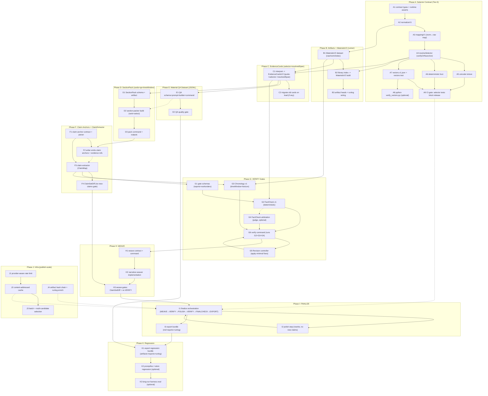

# Histwrite v4.1（出版级工作流加固 + Selector Contract Tier‑0）任务拆分（Runner‑First / Public Repo Edition）

> **For Claude:** REQUIRED SUB-SKILL: Use superpowers:executing-plans to implement this plan task-by-task.
>
> **Spec Doc（总体方案/宪法）**：`docs/plans/2026-03-10-histwrite-publication-workflow-v4.1-selector-contract.md`  
> **Master Index（单一入口）**：`docs/plans/2026-03-11-histwrite-publication-workflow-v4.1-master.md`  
> **Public Repo Mapping（路径映射/复用清单）**：`docs/plans/2026-03-11-histwrite-v4.1-public-repo-mapping.md`
>
> **这份文档是什么**：把 v4.1 计划**彻底适配**到公开仓库 `histwrite`（runner‑first）。  
> **这份文档不是什么**：它不是上游 Clawdbot 插件态的拆巨石/迁移计划。若你要做上游扩展版，请看：  
> `docs/plans/2026-03-10-histwrite-v4.1-selector-contract-task-breakdown.upstream-extension.md`

**Goal（目标）**：把 Histwrite 在本公开仓库落地为“出版级可追责工作流”，并把 Selector/Mapping 作为 Tier‑0 地基（Off‑by‑one/OCR 漂移在 Day‑1 就被单元/契约测试阻断）。  
**Philosophy（核心哲学）**：Compute‑First / Token‑Unlimited —— 默认用更多计算换拟真度与可交稿稳定性；但必须通过缓存/批处理/调度器避免并发墙与不可收敛。  
**Repo Reality（公开仓库现实）**：本仓库主战场是 `runner/`；`plugin-openclaw/` 只做薄转发；`relay/` 可选；`content/` 是规则与模板。不存在 9878 行 tool 巨石，因此 v4.1 的“真值层（selector/artifacts/gates/weave）”应全部落在 `runner/src/*`，避免双实现漂移。

---

## 0) Task Dependency DAG（全局依赖图：多 Agent 协作的安全网）

> 这张图的含义是“**硬依赖**”：`A --> B` 表示 **B 开工前 A 必须完成**。  
> 对于“建议但非硬依赖”的关系（例如 publish 体验强依赖 cache/rate-limit，但不影响功能正确性），用 `A -.-> B` 表示。
>
> **并行规则**：只有当两个任务在 DAG 上彼此无路径可达（且不共享 hot files）时，才允许并行；否则属于伪并行，会制造冲突与返工。

---

## 1) 任务拆分粒度：要详细到什么程度？

你的目标是“不省 token、效果最好、别的 agent 也能直接执行”。因此粒度标准是：

- **每个 Task 15–45 分钟可完成**（否则跨文件协调成本会反噬）。  
- 每个 Task 必须包含：
  1) 产出（新增模块/命令/schema/测试向量）
  2) 验收（至少 1 个 failing→pass 的 Vitest case 或可运行 CLI 命令）
  3) 失败可定位（报错能指向具体 selector/case/claim）
- Selector Contract 例外：可以拆细到 5–15 分钟级（因为它是 Tier‑0，且最容易出现“看似对齐、实则错位”）。

---

## 2) Public Repo 复用清单（不要重复造轮子）

在本仓库里，下列能力已存在，v4.1 直接复用/扩展即可：

- `runner/src/cache.ts`：内容寻址缓存的基础（对齐 Phase J2）
- `runner/src/runlog.ts`：运行日志/可回放链路基础（对齐 Artifacts build graph 的 run-log）
- `runner/src/openai-compat.ts` / `runner/src/openai-proxy.ts`：LLM 调用封装与兼容层（对齐 Phase J1 的调用基础）
- `runner/src/judge.ts`：LLM-as-a-judge 排序（可复用其“仲裁框架”服务 FactCheck Gate）
- `runner/src/rewrite.ts`：重写/精修（可作为 Polisher 的实现落点）
- `runner/src/final-check.ts`：终检门禁（对齐 Phase I 的 Finalcheck）
- `runner/src/exporting.ts`：导出（对齐 Phase I 的 EXPORT）

---

## 3) Hot Files 策略（在 runner 里也必须 single-owner）

为了避免把 `runner/src/cli.ts` 再做成新的巨石，v4.1 推进期把 hot files 固定为：

- `runner/src/cli.ts`（命令面/dispatch）
- `runner/src/project.ts`（项目布局与目录约定）
- `runner/src/indexing.ts`（材料入库与索引：Selector/QA/Gates 的上游）

规则：多 agent 并行时，hot files 只能 single-owner；其他人只在各自子目录/模块里施工，最后由集成 owner 合并。

---

## 4) Phase A — Selector Contract（Tier‑0，必须 Day‑1 阻断）

> **关键约束**（写进代码与测试）：跨模块/跨语言只信 `TextQuoteSelector(exact+prefix/suffix, layer=normText)`；offset 仅本地 hint；接收端必须 `verifyOrReanchor()`；失败即 `unresolvable`（Final 阶段 blocker）。

### A0（Runner 版测试拆分要求：避免单文件膨胀）

在 `runner/src/selector/` 下至少拆成：
- `contract.test.ts`（schema/序列化）
- `normalize.test.ts`（normText v1）
- `mapping.test.ts`（映射单调/边界/round‑trip）
- `resolve.test.ts`（verifyOrReanchor 行为矩阵）
- `torture.test.ts`（Unicode 极端用例）
- `fuzz.test.ts`（确定性 fuzz）
- `vectors.test.ts`（契约向量）

> 你也可以按“你那份 mapping 方案”的 4 文件拆法做，但我不建议把 fuzz/torture/vectors 都塞进同一个 resolve.test.ts —— 它会再次长成巨型测试文件，且并行 agent 极易冲突。

### Task A1: contract types + runtime asserts

**Files:**
- Create: `runner/src/selector/contract.ts`
- Test: `runner/src/selector/contract.test.ts`

**Must:**
- 半开区间 `[start,end)` 语义（仅内部 hint）
- `TextQuoteSelector` 是跨组件唯一真值
- 任何 selector bundle 都必须声明 layer（默认 `normText`）

**Run:**
- `pnpm -C runner test -- runner/src/selector/contract.test.ts`

### Task A2: normalizeV1（固定规则，禁止随意扩）

**Files:**
- Create: `runner/src/selector/normalize.ts`
- Test: `runner/src/selector/normalize.test.ts`

**Rules v1:**
- `\\r\\n|\\r -> \\n`
- 去 BOM `\\uFEFF`
- NBSP `\\u00A0 -> ' '`
- 禁止 NFC/NFKC

**Run:**
- `pnpm -C runner test -- runner/src/selector/normalize.test.ts`

### Task A3: mappingV1（norm↔raw map）

**Files:**
- Create: `runner/src/selector/mapping.ts`
- Test: `runner/src/selector/mapping.test.ts`

**Acceptance:**
- offset 映射单调性
- 0/len 边界一致
- quote 级 round‑trip：norm selector 能回到 raw slice

**Run:**
- `pnpm -C runner test -- runner/src/selector/mapping.test.ts`

### Task A4: resolveSelector（verifyOrReanchor）

**Files:**
- Create: `runner/src/selector/resolve.ts`
- Test: `runner/src/selector/resolve.test.ts`

**Behavior Matrix（至少 4 条 failing tests）：**
- position 正确 → `position_verified`
- position off-by-one → 丢弃 position → `quote_anchored`
- quote 多处匹配 → `quote_anchored_ambiguous`（要求 prefix/suffix 或人工确认）
- quote 不存在 → `unresolvable`（Final 阶段 blocker）

**Run:**
- `pnpm -C runner test -- runner/src/selector/resolve.test.ts`

### Task A5/A6/A7: torture + fuzz + vectors

**Files:**
- Create: `runner/src/selector/torture.test.ts`
- Create: `runner/src/selector/fuzz.test.ts`
- Create: `runner/src/selector/vectors.v1.json`
- Create: `runner/src/selector/vectors.test.ts`

**Run:**
- `pnpm -C runner test -- runner/src/selector/*.test.ts`

### Task A8: python verify_vectors.py（可选但推荐）

**Files（任选其一）：**
- Create: `scripts/verify_vectors.py`
- 或 Create: `runner/python/verify_vectors.py`

**Goal:** 用同一向量证明“不同实现也能稳定 re-anchor”（重点不是 offset，而是 quote anchoring）。

### Task A9: CI Gate（测试失败=阻断）

**Rule:** selector contract 任何变更必须 bump `selectorContractVersion` 并更新 vectors。

---

## 5) Phase B — Artifacts + MaterialsV2（runner 版“真值材料层”）

> 在公开仓库里，不做上游的 HistwriteStateV1→V2 迁移；我们要做的是 **Artifacts schema** 的版本化与落盘。

### Task B1: MaterialsV2 schema + dataset

**Files:**
- Create: `runner/src/artifacts/materials.ts`
- Test: `runner/src/artifacts/materials.test.ts`

**MaterialV2（最小字段，禁止缩水）：**
- `materialId`
- `provenance`（sourcePath/sourceSha256/textPath/textSha256/kind/title）
- `rawText`（权威引文来源）
- `normText`（定位层，来自 normalizeV1）
- `indexText`（检索层；只用于候选定位，不得直接引用）
- `selectorContractVersion`

### Task B2: 把 library index 产物升级为 MaterialsV2

**Files:**
- Modify: `runner/src/indexing.ts`（或新增 builder 模块供 indexing 调用）
- Modify: `runner/src/cli.ts`（挂载命令：例如 `histwrite materials build --project ...`）
- Test: `runner/src/indexing.materials-v2.test.ts`

**Output（建议落在材料索引目录）：**
- `材料/_index/materials.v2.json`（或 jsonl）

### Task B3: heads + runlog wiring

**Files:**
- Modify: `runner/src/runlog.ts`（如果需要：记录 artifact hash 链）
- Create: `runner/src/artifacts/heads.ts`
- Modify: `runner/src/project.ts`（可选：增加 artifactsDir）
- Test: `runner/src/artifacts/heads.test.ts`

**Invariant:** “回滚=改 heads 指针 + 重建下游”，而不是写逆操作状态机。

---

## 6) Phase C — EvidenceCardsV2（quote→selector→resolvedSpan）

### Task C1: interpret builder（证据卡化）

**Files:**
- Create: `runner/src/cards/interpret.ts`
- Create: `runner/src/cards/schema.ts`
- Create: `runner/src/prompts/interpret.ts`
- Modify: `runner/src/cli.ts`（新增命令：`histwrite interpret ...`）
- Test: `runner/src/cards/interpret.test.ts`

**Hard Rule:** Evidence 的 quote 必须能通过 resolver 从 rawText 重提取（允许排版差异，但不允许无根引用）。

### Task C2: migrate old cards on load（如未来导入旧数据）

**Files:**
- Create: `runner/src/cards/migrate.ts`
- Test: `runner/src/cards/migrate.test.ts`

---

## 7) Phase E — Material QA Dataset（材料“内涵外置化理解层”）

> QA 不是引用来源；它是“材料理解缓存”，用于提示 writer/packer “这段材料可能支持什么论点、有什么意义、有什么局限”。

### Task E1: QA builder + command

**Files:**
- Create: `runner/src/qa/schema.ts`
- Create: `runner/src/qa/builder.ts`
- Create: `runner/src/prompts/qa.ts`
- Modify: `runner/src/cli.ts`（新增命令：`histwrite qa build ...`）
- Test: `runner/src/qa/builder.test.ts`

**Hard Rule:** 每条 QA 必须绑定至少 1 条 evidence selector（最终可重提取 raw 引文）。

### Task E2: QA quality gate

**Files:**
- Create: `runner/src/qa/gate.ts`
- Test: `runner/src/qa/gate.test.ts`

---

## 8) Phase D — SectionPack（cards + qa + timeWindow + writing constraints）

> SectionPack 是 Writer 的“唯一事实输入面”：Writer 只允许使用 pack 内的 evidence/qa，不得自行引入新实体/新数字/新因果。

### Task D1: SectionPack schema + artifact

**Files:**
- Create: `runner/src/packs/schema.ts`
- Create: `runner/src/artifacts/packs.ts`
- Test: `runner/src/packs/schema.test.ts`

**Type Sketch（必须落到代码类型里）：**
- `SectionPack`：
  - `packId`
  - `blueprintRef`（artifact ref: blueprint head hash）
  - `sectionId`（来自 Blueprint 的章节/段落编号）
  - `timeWindow`（起止年或具体日期范围；必须显式）
  - `textWindow`（本节写作主题边界：允许写什么/禁止写什么/视角说明）
  - `cards[]`：
    - `cardId`
    - `selectedEvidenceIds[]`
    - `selectorBundles[]`（至少 quote selector；可带 position hint）
    - `resolvedSpans[]`（rawStart/rawEnd/extractedExactRaw/method）
  - `qa[]`：
    - `qaId`
    - `question`
    - `answer`
    - `evidenceRefs[]`（指向 card/material + selectorBundle）
  - `constraints`：如 `finalMissingGapsBlock=true`、`noNewClaims=true`

**Tests（至少 3 个 expect 断言骨架）：**
1) `SectionPack` 必须包含 `timeWindow`
2) `cards[].resolvedSpans[].method !== "unresolvable"`
3) 若 pack 含 `qa[]`，则每条 `qa.evidenceRefs.length >= 1`

**Run:**
- `pnpm -C runner test -- runner/src/packs/schema.test.ts`

### Task D2: section-packer build（rank + select）

**Files:**
- Create: `runner/src/packs/packer.ts`
- Create: `runner/src/prompts/pack.ts`
- Test: `runner/src/packs/packer.test.ts`

**Behavior（Compute‑First 但可收敛）：**
- 输入：`Blueprint@v2`、`EvidenceCardsV2`、（可选）`QADataset`
- 产出：每节 `SectionPack`
- 选择策略（v1）：先规则过滤（timeWindow/section keywords/显式 mustInclude），再用 `runner/src/judge.ts` 做 rank（可多候选+仲裁），最终输出 topK（建议 0–6 张 card + 0–12 条 qa）。

**Tests（至少 3 条）：**
1) 给定 10 张 cards，packer 只选 topK 并保持稳定排序（可 snapshot）
2) pack 中每张 card 必须携带 selector/resolvedSpan（此处 assert，避免上游漏传）
3) 若 blueprint 指定 `mustIncludeCardIds`，packer 必须包含；否则测试失败

**Run:**
- `pnpm -C runner test -- runner/src/packs/packer.test.ts`

### Task D3: pack command + outputs

**Files:**
- Modify: `runner/src/cli.ts`（新增 `histwrite pack build`）
- Create: `runner/src/packs/command.ts`
- Test: `runner/src/cli.pack-build.test.ts`

**Outputs（落盘建议）：**
- `packs/section.<sectionId>.pack.v1.json`
- `artifacts/heads.json` 更新 `packsHead`
- `runlog.jsonl` 追加 build 记录（inputsHash → outputsHash）

**Tests（至少 3 条）：**
1) CLI `--json` 输出包含 pack 路径与 head hash
2) 重复运行同一输入：若命中 cache（Phase J2），不重复调用 LLM（stub）
3) 输出目录不存在时自动创建

---

## 9) Phase F — Claim Anchors + ClaimExtractor（结构化可核查主张层）

> 目标：彻底避免 brittle substring matching。**ClaimMap 的来源只能是 anchors**，而不是“从自然语言里猜”。

### Task F1: claim anchor contract + parser

**Files:**
- Create: `runner/src/claims/contract.ts`
- Create: `runner/src/claims/parse.ts`
- Test: `runner/src/claims/parse.test.ts`

**Anchor 语法（推荐锁死）：**
- 开：`〔claim:<id>|kind=<...>|ev=<cardId>:<evidenceId>,...〕`
- 闭：`〔/claim〕`

**Must:**
- anchors 允许跨行，但禁止嵌套（嵌套=解析错误）
- 每个 claim 必须带 `kind`（entity/date/number/quote/causal/interpretation/secondary_view…）
- 每个 claim 必须带 `ev=`（至少 1 个 EvidenceRef），否则在 VERIFY 阶段 blocker

**Tests（至少 3 条）：**
1) 正常 anchor 能解析出 `id/kind/ev` 与 `spanText`
2) 未闭合 anchor 报错并指出位置
3) 嵌套 anchor 报错

### Task F2: writer emits claim anchors + evidence refs

**Files:**
- Create: `runner/src/prompts/write.ts`
- Create: `runner/src/writing/write-section.ts`
- Modify: `runner/src/cli.ts`（新增 `histwrite write section ...`）
- Test: `runner/src/writing/write-section.test.ts`

**Hard Rule（写进 prompt + tests）：**
- Writer 只允许使用 `SectionPack` 中出现的 `cardId/evidenceId`；不许自己发明引用。
- Writer 必须把“可核查主张”包进 anchors，并把 evidence refs 写进 `ev=...`。
- 证据不足必须写成推断/争议/缺口（Final 阶段缺口阻断由 Gate 决定）。

**Tests（至少 3 条）：**
1) 输出必须包含至少 1 个 `〔claim:`（或在空 pack 时允许 0）
2) anchors 中的 `ev=` 必须能在输入 pack 中找到（stub pack）
3) writer 输出若出现 pack 外的 `cardId` → 测试失败

### Task F3: claim-extractor（ClaimMap）

**Files:**
- Create: `runner/src/claims/extract.ts`
- Create: `runner/src/artifacts/claims.ts`
- Modify: `runner/src/cli.ts`（新增 `histwrite claims extract ...`）
- Test: `runner/src/claims/extract.test.ts`

**Output:**
- `ClaimMap`：`{ claimId, kind, text, evidenceRefs[], timeHint?, riskFlags[] }`

**Tests（至少 3 条）：**
1) 对同一草稿重复抽取，ClaimMap 稳定（deterministic）
2) 若 `ev=` 引用不存在的证据，ClaimMap 标记 `invalid_evidence_ref`
3) ClaimMap 能生成 `ClaimSet`（用于 diff）

### Task F4: ClaimSetDiff（no-new-claims gate）

**Files:**
- Create: `runner/src/claims/diff.ts`
- Test: `runner/src/claims/diff.test.ts`

**Gate Rule:**
- Weaver/Polish 之后 `addedClaims == 0`，否则 blocker

---

## 10) Phase G — VERIFY Gates（FactCheck + Chronology + Revision Loop）

> 这是 v4.1 的“阻断式安全网”。理念：**能规则化的先规则化；需要模型判断的只做仲裁/分歧归类**，并且全程落盘可审计。

### Task G1: gate schemas（reports + workorders）

**Files:**
- Create: `runner/src/gates/schema.ts`
- Create: `runner/src/artifacts/reports.ts`
- Test: `runner/src/gates/schema.test.ts`

**Must include:**
- `FactCheckReport`：per claim 的 status + evidence alignment + issues + minimalFix
- `ChronologyReport`：timeWindow violation + anachronism signals + high_risk
- `WorkOrders`：`{ action: delete|downgrade|add_contested|needs_more_evidence|rewrite_span, targetClaimId, instructions }`

### Task G2: FactCheck v1（deterministic）

**Files:**
- Create: `runner/src/gates/factcheck.ts`
- Test: `runner/src/gates/factcheck.test.ts`

**Algorithm v1（必须先落地规则核查）：**
1) 对每个 claim：检查 `evidenceRefs[]` 非空，否则 `unsupported` blocker
2) 对每个 evidenceRef：验证能在 `EvidenceCardsV2` 中找到，并且 selector 可 resolve 到 rawText（`method !== unresolvable`）
3) 若 claim.kind 是 `quote`：强制要求 evidence.level=direct 且 quote extractedExactRaw 非空

**Tests（至少 3 条）：**
1) 缺失 `ev=` 的 claim → `unsupported` + blocker
2) 引用不存在 evidence → `unsupported` + blocker
3) evidence selector ambiguous → `contested_or_ambiguous` + 需要人工确认（Final 阶段 blocker 由配置决定）

### Task G3: Chronology v1（timeWindow + lexicon）

**Files:**
- Create: `runner/src/gates/chronology.ts`
- Create: `content/chronology/lexicon.v1.json`（种子词表：作物/制度/术语/官职/地名的年代风险）
- Test: `runner/src/gates/chronology.test.ts`

**Checks v1：**
- claim 的 `timeHint` 或 blueprint 的 `timeWindow` 外溢 → blocker
- `lexicon` 命中 → `high_risk`（Draft 可警告，Final 可阻断，取决于 constraints）

**Tests（至少 3 条）：**
1) timeWindow 外溢的 claim → blocker
2) lexicon 命中 → high_risk（并包含命中的词/规则 id）
3) 未提供 timeHint 时，必须回退到 section timeWindow（仍能给出结果）

### Task G4: FactCheck arbitration（judge，可选但推荐）

**Files:**
- Create: `runner/src/gates/factcheck-judge.ts`
- Create: `runner/src/prompts/factcheck-judge.ts`
- Test: `runner/src/gates/factcheck-judge.test.ts`

**Goal：**
- 对 `inference_ok / contested` 做更细分：是否需要补充对立解释、是否语气越界（把推断写成史实）
- 输出必须是结构化 JSON（tool‑as‑contract）

### Task G5: Revision controller（apply minimal fixes）

**Files:**
- Create: `runner/src/gates/revision.ts`
- Create: `runner/src/prompts/revision.ts`
- Test: `runner/src/gates/revision.test.ts`

**Hard Rule：**
- 只允许“定点修复”：删除 span / 降格语气 / 补 contested 引述 / 生成缺口任务
- 修复后必须再跑：`claims extract` → `verify` → `ClaimSetDiff`（added==0）

### Task G6: verify command（runs FactCheck + Chronology + optional judge）

**Files:**
- Modify: `runner/src/cli.ts`（新增 `histwrite verify ...`）
- Create: `runner/src/gates/command.ts`
- Test: `runner/src/cli.verify.test.ts`

**Acceptance：**
- blockers>0 时 CLI 返回非 0（或 `--json` 标记 status=failed）
- 输出落盘 `reports/factcheck.v1.json`、`reports/chronology.v1.json`

---

## 11) Phase H — WEAVE（Narrative Weaver：只缝合不造事实）

> 你指出的 “Frankenstein Text” 在这里解决：Weaver 负责把段落缝合成统一文脉，但 **禁止新增可核查主张**。

### Task H1: weave contract + command

**Files:**
- Create: `runner/src/weave/schema.ts`
- Create: `runner/src/weave/command.ts`
- Modify: `runner/src/cli.ts`（新增 `histwrite weave ...`）
- Test: `runner/src/weave/command.test.ts`

### Task H2: narrative weaver implementation

**Files:**
- Create: `runner/src/weave/narrative-weaver.ts`
- Create: `runner/src/prompts/weave.ts`
- Test: `runner/src/weave/narrative-weaver.test.ts`

**Hard Constraints（写进 tests）：**
- 输出必须保留所有 claim anchors（不可删除、不可篡改 `id/kind/ev`）
- 输出禁止新增 claim anchors（新增=addedClaims>0=blocker）
- 输出允许：段落过渡、指代回指、术语统一、重复解释合并

### Task H3: weave gates（ClaimSetDiff + re‑VERIFY）

**Files:**
- Create: `runner/src/weave/gates.ts`
- Test: `runner/src/weave/gates.test.ts`

**Acceptance：**
- weave 后：`ClaimSetDiff.added == 0`
- weave 后：必须强制再跑 `verify`（FactCheck+Chronology）并落盘

---

## 12) Phase I — FINALIZE（WEAVE→VERIFY→POLISH→VERIFY→FINALCHECK→EXPORT）

> Finalize 是“出版级交付”的唯一入口：不允许用户手工跳过门禁拼凑导出。

### Task I1: finalize orchestration command

**Files:**
- Create: `runner/src/finalize/finalize.ts`
- Modify: `runner/src/cli.ts`（新增 `histwrite finalize ...`）
- Test: `runner/src/finalize/finalize.test.ts`

**Pipeline（锁死顺序）：**
1) `weave`
2) `verify`
3) `polish`
4) `verify`
5) `finalcheck`
6) `export`

**Acceptance：**
- 任一步 blockers>0 → 立即失败并输出“下一步行动”（补证/改写/人工确认）

### Task I2: polish step（rewrite, no new claims）

**Files:**
- Create: `runner/src/finalize/polish.ts`（内部调用 `runner/src/rewrite.ts`）
- Create: `runner/src/prompts/polish.ts`
- Test: `runner/src/finalize/polish.test.ts`

**Hard Rule：**
- Polish 前后 ClaimSetDiff 必须 added==0（否则回滚并报错）

### Task I3: export bundle（md + reports + runlog）

**Files:**
- Create: `runner/src/finalize/export-bundle.ts`
- Modify: `runner/src/exporting.ts`（如需：支持报告随正文一起打包）
- Test: `runner/src/finalize/export-bundle.test.ts`

**Output Bundle：**
- `Final.md`
- `reports/factcheck.json`
- `reports/chronology.json`
- `reports/finalcheck.md`
- `runlog.jsonl`
- `artifact-heads.json`

---

## 13) Phase J — Infra（Compute‑First 但必须可收敛）

> 目标：你要“无限 token + 最拟真”，我给你“算力拉满但不触发并发墙”的工程底座。

### Task J1: provider-aware rate limit（scheduler）

**Files:**
- Create: `runner/src/infra/scheduler.ts`
- Modify: `runner/src/openai-proxy.ts`（接入 scheduler）
- Test: `runner/src/infra/scheduler.test.ts`

**Acceptance：**
- 支持 maxConcurrency、指数退避、429/5xx 重试策略
- 支持 priority（VERIFY/FINALIZE > DRAFT）

### Task J2: content-addressed cache（extend existing）

**Files:**
- Modify: `runner/src/cache.ts`
- Test: `runner/src/cache.v4.1.test.ts`

**Key：**
- `cacheKey = taskName + promptVersion + inputsHash + modelId`

### Task J3: batch + multi-candidate selection

**Files:**
- Create: `runner/src/infra/batch.ts`
- Modify: `runner/src/judge.ts`（支持 n-best + 选择理由落盘）
- Test: `runner/src/infra/batch.test.ts`

### Task J4: artifact hash chain + runlog enrich

**Files:**
- Modify: `runner/src/runlog.ts`
- Test: `runner/src/runlog.v4.1.test.ts`

**Acceptance：**
- 每次 build 写入 inputsHash/outputsHash、依赖 heads、门禁结果摘要

---

## 14) Phase K — Regression（fixture + golden + eval）

### Task K1: regression fixture project（小样本可回放）

**Files:**
- Create: `content/examples/v4.1-fixture/`（5–10 条材料 + 1 节 500–900 字目标）
- Create: `content/examples/v4.1-fixture/README.md`

### Task K2: e2e regression test（mock LLM, assert artifacts）

**Files:**
- Create: `runner/src/e2e/v4.1-fixture.e2e.test.ts`

**Acceptance：**
- 跑完整 pipeline（mock LLM 输出固定），断言：
  - `FactCheckReport.blockers == 0`
  - `ChronologyReport.blockers == 0`（或高风险已标注）
  - `finalcheck.placeholderCount == 0`
  - `ClaimSetDiff.added == 0`（weave/polish 后）

### Task K3: long-run harness eval（可选）

**Goal：**
- 引入“长运行 harness”式评测：用固定 fixture 多次跑（不同随机种子/多候选），看收敛与稳定性（对齐 Anthropic 的 long-running harness 最佳实践）。
