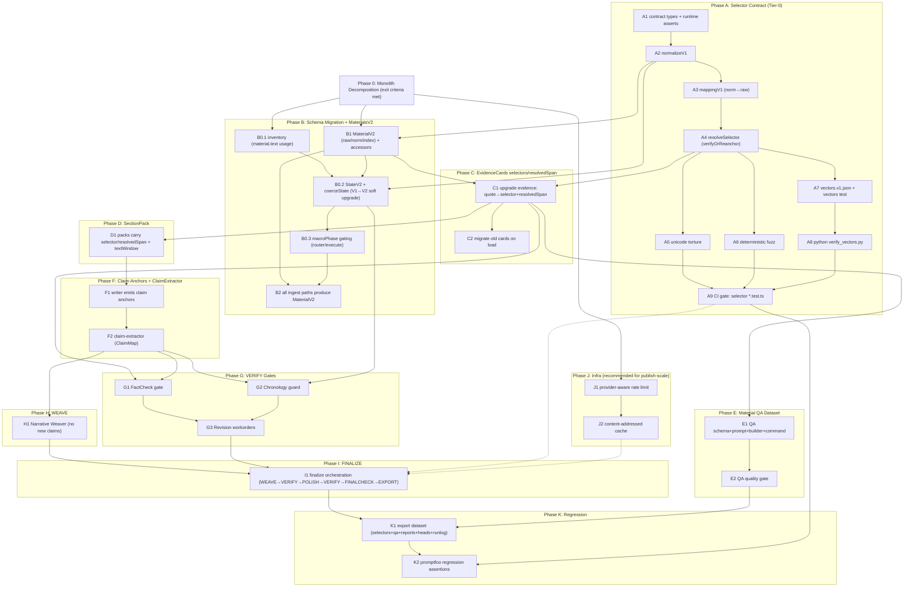

# Histwrite v4.1（出版级工作流加固 + Selector Contract Tier‑0）任务拆分（Execution Breakdown）

> **For Claude:** REQUIRED SUB-SKILL: Use superpowers:executing-plans to implement this plan task-by-task.
>
> **Spec Doc（总体方案/宪法）**：`docs/plans/2026-03-10-histwrite-publication-workflow-v4.1-selector-contract.md`

**Goal（目标）**：把 Histwrite 落地为“出版级可追责工作流”，并把 Selector/Mapping 作为 Tier‑0 地基（Off‑by‑one/OCR 漂移在 Day‑1 就被单元/契约测试阻断）。  
**Architecture（一句话）**：6 宏状态（PLAN/EVIDENCE/DRAFT/VERIFY/WEAVE/FINAL）+ Artifacts Build Graph（immutable artifacts + heads 指针 + stale 重建）+ 三重门禁（FactCheck/Chronology/Finalcheck）+ Material QA Dataset。  
**Tech Stack**：TypeScript ESM、Vitest、现有 Histwrite JSON‑only + Ajv schema 校验、（可选）Python 仅用于离线验证脚本。

---

## 0) Task Dependency DAG（全局依赖图：多 Agent 协作的安全网）

> 这张图的含义是“**硬依赖**”：`A --> B` 表示 **B 开工前 A 必须完成**。  
> 对于“建议但非硬依赖”的关系（例如 cache/rate-limit 对 publish 体验很重要，但不影响功能正确性），用 `A -.-> B` 表示。
>
> **并行规则**：只有当两个任务在 DAG 上彼此无路径可达（且不共享 hot files）时，才允许并行；否则属于伪并行，会制造冲突与返工。



---

## A) 任务拆分要“详细到什么程度”（本项目推荐粒度）

> 你的核心诉求是：**不省 token、效果最好**，并且“别的 agent 也能直接上手执行”。因此这里的粒度标准是“可外包给另一个 agent 执行，不需要再做任何产品/工程决策”。

### A.1 推荐粒度（默认）

- **每个 Task 15–45 分钟可完成**（而不是 2–5 分钟）：因为本项目大量涉及 schema/兼容/测试向量，拆得太碎会让跨文件协调成本上升。  
- **每个 Task 必须同时包含：**
  1) 明确的产出（新增模块/新增 schema/新增命令/新增测试向量）
  2) 验收点（新增/更新 Vitest；或能跑通的 CLI 命令）
  3) 失败时的定位方式（报错信息应该指向具体 case 或 selector）
- **每个 Task 的“写代码顺序”采用 TDD 微循环**：先写 failing test，再实现最小代码，再跑测试（与写作链路无关的任务也必须有“可执行验收”）。

### A.2 何时需要更细（5–15 分钟级 Task）

仅对 **Tier‑0 Selector Contract** 与 **跨组件契约向量** 采用更细拆分，因为它们最容易出现“看似对齐、实则错位”的致命 bug，必须把定位粒度压到具体 unicode/newline case。

---

## B) 现实约束：巨石文件是“隐形地雷”（必须先拆，才能谈并行）

你指出的问题完全成立：当前 Histwrite 的实际工程形态，会让“并行施工策略”在 Phase B/C 直接失效。

**冷硬事实（repo 现状）**：

| 指标 | 现状 |
|---|---|
| `extensions/histwrite/src/histwrite-tool.ts` | ~9,878 行，单体巨石 |
| `extensions/histwrite/src/histwrite-tool.test.ts` | ~3,056 行，单体测试巨石 |
| `extensions/histwrite/src/` | 总共 6 个文件，无子目录 |
| Material 类型 | `{ id: string; text: string; addedAt: number }` |
| 计划目录 | `selector/ cards/ gates/ weave/ qa/` 均不存在 |
| 状态机 | 仅 `Phase = clarify/draft/polish` |

**直接后果**：
- 若 Phase B/C/D/E/F/G/H 仍大量“Modify: histwrite-tool.ts / histwrite-tool.test.ts”，多 agent 并行必然大量冲突。
- 这会把“工程推进”变成“冲突解决”，导致停滞。

**修正结论（必须写进计划）**：
- 在进入 v4.1 功能开发前，必须增加 **Phase 0：Monolith Decomposition（巨石拆解）**。  
- 在 Phase 0 完成前，允许并行的工作仅限于“新增目录/新增模块/新增测试文件”，禁止多 agent 同时改 `histwrite-tool.ts` / `histwrite-tool.test.ts`。

---

## C) Phase 0 — Monolith Decomposition（巨石拆解，先决条件）

**完整拆解计划文档**：`docs/plans/2026-03-10-histwrite-monolith-decomposition.md`

**Phase 0 目标**：
- 把未来一定会改的触点迁移出 `histwrite-tool.ts`：materials / interpret / cards / packs / write / polish / finalcheck / router。
- 建立目录边界：`tool/ core/ prompts/ commands/`，并明确 hot files 的 single-owner 策略。
- 后续新增的 `selector/ cards/ gates/ weave/ qa/` workstreams 基本不需要直接改巨石。

**Phase 0 Exit Criteria（未达成不得进入后续 Phase 的“集成步骤”）**：
1) `extensions/histwrite/src/histwrite-tool.ts` 变为薄入口（re-export + minimal glue）  
2) “未来必改点”已迁移到 `tool/ core/ prompts/ commands/`  
3) `pnpm vitest run --config vitest.extensions.config.ts extensions/histwrite/src/histwrite-tool.test.ts` 全量通过  
4) `extensions/histwrite/src/tool/router.ts` 与 `extensions/histwrite/src/tool/execute.ts` 被明确标记为 hot files（single-owner）

---

## D) 并行施工策略（Phase 0 完成后才成立）

> Phase 0 之后，“并行”才不再是纸面承诺。此处给出 **新的文件所有权与冲突避免策略**。

### D.1 Hot Files（不可并行修改：single-owner）

- `extensions/histwrite/src/tool/router.ts`
- `extensions/histwrite/src/tool/execute.ts`
- （视实现而定）`extensions/histwrite/src/core/state.ts`

规则：任何需要改这些文件的工作，都必须通过“集成 agent”合并；其他 agent 不直接改。

### D.2 Workstreams（Phase 0 之后的有效并行切分）

- Workstream 0（集成/路由 owner）：hot files + 命令注册 + 对外行为一致性回归（**所有 hot files 只允许该 owner 合并**）  
- Workstream 1（Tier‑0 Selector）：`extensions/histwrite/src/selector/*` + `extensions/histwrite/src/selector/*.test.ts` + `extensions/histwrite/python/verify_vectors.py`  
- Workstream 2（Materials V2）：`extensions/histwrite/src/core/materials.ts` + `extensions/histwrite/src/core/state.ts` + `extensions/histwrite/src/commands/material.ts`（**硬依赖：Workstream 1 的 `normalizeV1()`**）  
- Workstream 3（Cards/Packs）：`extensions/histwrite/src/core/cards.ts` + `extensions/histwrite/src/core/packs.ts` + `extensions/histwrite/src/commands/interpret.ts` + `extensions/histwrite/src/commands/outline.ts` + `extensions/histwrite/src/commands/write.ts`（**硬依赖：Workstream 2（MaterialV2）+ Workstream 1（resolveSelector）**）  
- Workstream 4（QA Dataset）：`extensions/histwrite/src/qa/*` + `extensions/histwrite/src/commands/qa.ts`  
  - 可并行子集：`qa/schema.ts` / `prompts/qa.ts` / `qa/builder.test.ts` 的 stub harness  
  - 集成验收硬依赖：Workstream 3 的 C1（evidence 已升级到 selector+resolvedSpan），见 DAG：`C1 --> E1`  
- Workstream 5（VERIFY Gates）：`extensions/histwrite/src/gates/*` + `extensions/histwrite/src/commands/gate.ts`  
  - 硬依赖：Workstream 3 的 F1/F2（anchors+claim map）与 C1（evidence selectors），见 DAG：`F2 --> G1` + `C1 --> G1`  
- Workstream 6（Weave/Finalize）：`extensions/histwrite/src/weave/*` + `extensions/histwrite/src/commands/finalize.ts`（或同等位置）  
  - 硬依赖：Workstream 5（VERIFY 可跑）+ Workstream 3（anchors 可解析）  
  - 软依赖：Workstream 1 的 A9（selector tests gate）+ Workstream J（rate-limit/cache）用于 publish-scale

---

## Phase A — Tier‑0：Selector Contract + Text Mapping + Torture/Fuzz + 向量契约（必须先做）

> **完成本 Phase 才允许进入任何“证据卡升级/门禁/高亮”工作。**

> ⚠️ 测试文件拆分（避免 `histwrite-tool.test.ts` 式的单点灾难）  
> selector 的测试 **必须按关注点拆分**，并且每个子任务只改自己的 test 文件，确保多 agent 并行不会踩踏同一文件。
>
> **Selector Tests Layout（强制）**：
> - `extensions/histwrite/src/selector/contract.test.ts`：类型/序列化约束（不测 normalize/mapping/resolve）
> - `extensions/histwrite/src/selector/normalize.test.ts`：规范化（normText v1）
> - `extensions/histwrite/src/selector/mapping.test.ts`：mapping（单调/边界/round-trip）
> - `extensions/histwrite/src/selector/resolve.test.ts`：resolver（verifyOrReanchor 行为矩阵）
> - `extensions/histwrite/src/selector/torture.test.ts`：Unicode torture（极端字符族 + 换行族）
> - `extensions/histwrite/src/selector/fuzz.test.ts`：deterministic fuzz（固定 seed）
> - `extensions/histwrite/src/selector/vectors.test.ts`：契约向量加载（vectors.v1.json）

### Task A1: 建立 selector contract 的类型与最小 API（无行为，先定边界）

**Files:**
- Create: `extensions/histwrite/src/selector/contract.ts`
- Create: `extensions/histwrite/src/selector/contract.test.ts`

**Step 1: 写 failing tests（类型/序列化约束）**
- 断言：`TextQuoteSelector.layer` 默认 `normText`
- 断言：偏移语义采用 `[start,end)`；unit 固定为 `utf16_code_unit`
- 断言：Python 侧不允许生成 offset 真值（以契约向量/注释约束体现；TS 侧先做 runtime 校验）

**Step 2: 运行测试（应失败）**
- Run: `pnpm vitest run --config vitest.extensions.config.ts extensions/histwrite/src/selector/contract.test.ts`

**Step 3: 最小实现**
- 只实现 types + `assertValidSelector()`（runtime 校验），不实现 resolver。

**Step 4: 再跑测试（应通过）**

---

### Task A2: 实现 normText v1 规范化（\r\n/\r→\n、去 BOM、NBSP→space）并给出可验证元数据

**Files:**
- Create: `extensions/histwrite/src/selector/normalize.ts`
- Create: `extensions/histwrite/src/selector/normalize.test.ts`

**Step 1: 写 failing tests（固定输入→固定输出）**
- 覆盖：`\r\n`、`\r`、`\n`、`\uFEFF`、`\u00A0`
- 断言：禁止 NFC/NFKC（这里体现为：normalize 不调用任何 unicode normalize）

**Step 1.5: 运行测试（应失败）**
- Run: `pnpm vitest run --config vitest.extensions.config.ts extensions/histwrite/src/selector/normalize.test.ts`

**Step 2: 实现 `normalizeV1(rawText, opts)`**
- 输出：`{ rawText, normText, selectorContractVersion: 1 }`

**Step 3: 再跑测试（应通过）**
- Run: `pnpm vitest run --config vitest.extensions.config.ts extensions/histwrite/src/selector/normalize.test.ts`

---

### Task A3: 实现 norm→raw 的映射（用于 resolver 重提取 raw 引文）

**Files:**
- Create: `extensions/histwrite/src/selector/mapping.ts`
- Create: `extensions/histwrite/src/selector/mapping.test.ts`

**Step 1: 写 failing tests（mapping 单调/边界/round‑trip）**
- 单调性：映射不倒退
- 边界：0 与 len 的映射成立
- round‑trip：随机选择 norm span，映射回 raw 后再 normalize，应能覆盖回原 span（在允许变换下）

**Step 1.5: 运行测试（应失败）**
- Run: `pnpm vitest run --config vitest.extensions.config.ts extensions/histwrite/src/selector/mapping.test.ts`

**Step 2: 实现 `buildMappingV1(rawText) -> { normText, normToRaw }`**
- 注意：使用 **utf16 code unit** 索引（JS `.length` 语义）。

**Step 3: 再跑测试（应通过）**
- Run: `pnpm vitest run --config vitest.extensions.config.ts extensions/histwrite/src/selector/mapping.test.ts`

---

### Task A4: 实现 `resolveSelector()`（Quote 优先，Position 仅 hint）

**Files:**
- Create: `extensions/histwrite/src/selector/resolve.ts`
- Create: `extensions/histwrite/src/selector/resolve.test.ts`

**Step 1: 写 failing tests（verifyOrReanchor 行为矩阵）**
- position 正确 → `position_verified`
- position off‑by‑one → 丢弃 position → `quote_anchored`
- quote 多处出现 → `quote_anchored_ambiguous`（必须返回候选列表/原因）
- quote 不存在 → `unresolvable`

**Step 1.5: 运行测试（应失败）**
- Run: `pnpm vitest run --config vitest.extensions.config.ts extensions/histwrite/src/selector/resolve.test.ts`

**Step 2: 实现 resolver（必须返回 rawStart/rawEnd/extractedExactRaw）**

**Step 3: 再跑测试（应通过）**
- Run: `pnpm vitest run --config vitest.extensions.config.ts extensions/histwrite/src/selector/resolve.test.ts`

---

### Task A5: Unicode Torture Suite（必须单独成组）

**Files:**
- Create: `extensions/histwrite/src/selector/torture.test.ts`

**Step 1: 增加 torture cases 并断言 resolve 不崩/不乱**
- surrogate/non‑BMP、ZWJ、组合附加符、VS16、双向控制字符
- 换行全集：`\n`、`\r\n`、`\r`、`\u2028`、`\u2029`、`\u0085`
- 空白：NBSP、零宽、细空格

**Step 2: 运行测试（应通过；若失败必须能定位到具体 case）**
- Run: `pnpm vitest run --config vitest.extensions.config.ts extensions/histwrite/src/selector/torture.test.ts`

---

### Task A6: Deterministic Fuzz（固定 seed，抓“偶发 off‑by‑one”）

**Files:**
- Create: `extensions/histwrite/src/selector/fuzz.test.ts`

**Step 1: 实现一个固定 seed 的伪随机生成器（不要引入依赖）**
**Step 2: 随机生成文本→抽 span→造 quote selector→resolve→必须回到同一 raw 片段**

**Step 3: 运行 fuzz（默认次数要可控；CI 先跑 200–500 次，publish 可手动跑 2k+）**
- Run: `pnpm vitest run --config vitest.extensions.config.ts extensions/histwrite/src/selector/fuzz.test.ts`

---

### Task A7: 契约向量文件（JSON/base64）+ TS 端加载与测试

**Files:**
- Create: `extensions/histwrite/src/selector/vectors.v1.json`
- Create: `extensions/histwrite/src/selector/vectors.test.ts`

**Step 1: 写 vectors（至少 10 条，覆盖全部关键字符族）**
- 字段：`rawText_b64`、`normText_expected_b64`、`selectors[]`、`expected_extractedExactRaw_b64`（或 expected method）

**Step 2: TS 测试读取 vectors 并逐条断言**

**Step 3: 运行测试**
- Run: `pnpm vitest run --config vitest.extensions.config.ts extensions/histwrite/src/selector/vectors.test.ts`

---

### Task A8: Python `verify_vectors.py`（一键验证跨组件：只传 quote selector）

**Files:**
- Create: `extensions/histwrite/python/verify_vectors.py`

**Step 1: 读取 `vectors.v1.json`，逐条做：base64 decode →（Python 仅验证 quote selector 的基本结构）→ 打印通过/失败摘要**
- 注意：Python 不需要复刻 TS 的 utf16 offset；目标是“跨组件只传 quote selector”，Python 不要输出 offset 真值。

---

### Task A9: 把 Tier‑0 测试升格为“阻断式门禁”

**Files:**
- (Optional) Modify: `docs/testing.md` 或新增一段到 `extensions/histwrite/README.md`

**验收**：
- `pnpm vitest run --config vitest.extensions.config.ts extensions/histwrite/src/selector/*.test.ts` 必须在 CI/本地默认通过
- 任何 selector contract 改动必须 bump `selectorContractVersion` 并更新 vectors

---

## Phase B — Schema Migration（V1 → V2：State / Phase / Blueprint / Materials）+ Materials 三层文本

> 你指出的“State 模型断层”是 v4.1 的硬前置：如果不先做 Schema Migration，后续 WEAVE/VERIFY/FINAL 都会变成“文档里有、代码里没有”的空转。
>
> **单独迁移计划（完整任务清单 + 类型列表 + Phase 3→6 迁移策略 + material.text inventory + coerceState 升级方案）**：
> - `docs/plans/2026-03-10-histwrite-schema-migration-v1-to-v2.md`

### Phase B 的“集成脊柱”（解决你说的 Phase A→B 真空）

> 这一段的目的：让执行 Phase B/C 的工程师拿到工单后，**知道在代码里从哪儿切入、怎么把 selector/ 接进来、以及哪里会踩坑**。

**Selector 的唯一可信输入/输出（Phase A 交付）**：
- 输入：`MaterialV2.rawText`（权威原文）
- 派生：`normalizeV1(rawText) -> normText`（轻度规范化）
- 引文锚：`TextQuoteSelector{ layer:"normText", exact, prefix, suffix }`
- 解析：`resolveSelector({ rawText, normText? }, selectorBundle) -> ResolvedSpan{ rawStart/rawEnd/extractedExactRaw/method }`

**Phase B/C 需要完成的“接线”**（最小稳定接入点，避免到处散插 resolver）：
- `core/materials.ts`：提供 **唯一入口** `materialFromRawText()` / `upgradeMaterialV1ToV2()`，内部调用 `normalizeV1()` 生成三层文本与 `selectorContractVersion`。
- `core/cards.ts`：提供 **唯一入口** `upgradeEvidenceQuoteToSelector()` / `upgradeCardEvidenceSelectors()`，内部调用 `resolveSelector()` 把 quote 变成 selector+resolvedSpan，并返回 `ok/ambiguous/unresolvable`。
- `commands/material.ts`：所有“入库入口”只调用 `core/materials.ts`（禁止再手写 `state.materials.push({text})`）。
- `commands/interpret.ts`：在“写卡/落盘前”调用 `core/cards.ts` 做 evidence 升级（禁止把 resolver 散在 UI 渲染/pack 构建里）。

**Monolith 定位锚点（2026-03-10 基线，仅用于 Phase 0 前的对照）**：
- V1 schema 定义：`extensions/histwrite/src/histwrite-tool.ts:329-428`（`Phase/Blueprint/Material/HistwriteStateV1/coerceState`）
- state 读写入口：`extensions/histwrite/src/histwrite-tool.ts:4671-4706`（`statePath/readJsonFile/coerceState/saveState`）
- `/histwrite material` 入库：`extensions/histwrite/src/histwrite-tool.ts:6501-6509`（`state.materials.push`）
- interpret 入口：`extensions/histwrite/src/histwrite-tool.ts:6619`（`if (verbLower === "interpret")`）
- interpret 生成 materials 的写入点：`extensions/histwrite/src/histwrite-tool.ts:6507/7016/7444/7450/7996`（`state.materials.push(...)`）
- 证据结构：`extensions/histwrite/src/histwrite-tool.ts:899-1000`（`HistwriteCardEvidenceV1` / `normalizeCardEvidence()`）
- SectionPack 读取 material 文本：`extensions/histwrite/src/histwrite-tool.ts:1900`（`buildSectionPackTextWindow(material?.text)`）
- interpret 单条 material 解析：`extensions/histwrite/src/histwrite-tool.ts:7409`（`resolveTargetMaterial()` 使用 `exact.text`）

> 说明：Phase 0 拆解后，上述锚点会迁移到 `extensions/histwrite/src/{core,tool,commands}/`；但执行者仍可用这些锚点对照“迁移前后是否漏改”。

### Task B0.1: 迁移盘点（material.text 使用点 inventory）

**Files:**
- Create: `docs/plans/2026-03-10-histwrite-material-text-usage-inventory.md`

**Step 1: 生成清单（Phase 0 拆解完成后执行）**
- Run: `rg -n "\\.text\\b" extensions/histwrite/src`
- Run: `rg -n "materials\\b" extensions/histwrite/src`
- 将命中列表固化到 inventory 文档（后续每次大迁移可更新）

验收：
- inventory 文档存在，且可复现（命令可再次跑出同类结果）

---

### Task B0.2: 引入 `HistwriteStateV2` + `coerceState()`（读 V1 / 写回 V2）

**Files:**
- Modify: `extensions/histwrite/src/core/state.ts`
- Test: `extensions/histwrite/src/core/state.test.ts`

**Step 1: 写 failing test（V1 → V2：phase/materials/blueprint 默认字段）**

Test: `extensions/histwrite/src/core/state.test.ts`

```ts
import { describe, expect, test } from "vitest";
import { coerceState } from "./state.js";

describe("coerceState V1->V2", () => {
  test("migrates phase/materials/blueprint defaults", () => {
    const v1 = {
      version: 1,
      updatedAt: 1,
      enabled: true,
      phase: "clarify",
      blueprint: { coreQuestion: "Q", thesis: "T" },
      materials: [{ id: "m1", addedAt: 1, text: "a\\r\\nb\\u00A0c" }],
      history: [],
      lastDraft: "draft",
    };
    const v2 = coerceState(v1 as any);
    expect(v2.version).toBe(2);
    expect(v2.legacyPhase).toBe("clarify");
    expect(v2.macroPhase).toBe("PLAN");
    expect(v2.materials[0].rawText).toBe("a\\r\\nb\\u00A0c");
    expect(v2.materials[0].normText).toBe("a\\nb c");
    expect(v2.materials[0].indexText).toBe("a\\nb c");
    expect(v2.materials[0].selectorContractVersion).toBe(1);
    expect(v2.blueprint.constraintsConfig).toEqual(
      expect.objectContaining({
        finalBlocksOnGaps: true,
        finalBlocksOnHighRiskChronology: true,
      }),
    );
  });
});
```

**Step 2: 运行测试（应失败）**
- Run: `pnpm vitest run --config vitest.extensions.config.ts extensions/histwrite/src/core/state.test.ts`
- 期望失败点：`coerceState` 不存在 / 返回 schema 不含 `version=2/macroPhase/materials[].rawText/normText`

**Step 3: 实现 `HistwriteStateV2` + `coerceState()`**
- 在 `extensions/histwrite/src/core/state.ts`：
  - 定义 `MacroPhase`（6 宏状态）
  - 定义 `HistwriteStateV2`（`version:2` + `legacyPhase?` + `macroPhase` + `heads` + `contractVersions`）
  - `coerceState(any)->V2`：
    - 若输入为 V1：做映射 `clarify→PLAN / draft→DRAFT / polish→FINAL`
    - materials：调用 `core/materials.ts` 的 `upgradeMaterialV1ToV2()`（不允许在 state.ts 里手搓 normalize）
    - blueprint：调用 `core/blueprint.ts`（或内联 `coerceBlueprintV2`）做默认字段填充

**Step 4: 运行测试（应通过）**
- Run: `pnpm vitest run --config vitest.extensions.config.ts extensions/histwrite/src/core/state.test.ts`

**Step 5: 增加“软升级写回”测试（读到 V1 → 运行结束写回 V2）**
- Test: `extensions/histwrite/src/tool/execute.test.ts`
- 断言点：
  - 给一个 V1 state 文件
  - 执行任意无副作用命令（如 `/histwrite help`）
  - 读取写回后的 state 文件，断言 `version===2`

---

### Task B0.3: Phase 迁移：从 `phase=clarify|draft|polish` gating → `macroPhase` gating

**Files:**
- Modify: `extensions/histwrite/src/tool/router.ts`（hot file：single-owner）
- Modify: `extensions/histwrite/src/tool/execute.ts`（hot file：single-owner）
- Test: `extensions/histwrite/src/tool/router.test.ts`

**Step 1: 写 failing test（status 输出同时显示 legacyPhase + macroPhase）**

Test: `extensions/histwrite/src/tool/router.test.ts`

断言（示例）：
- `status` 文本必须包含：
  - `legacyPhase:`（或 “旧阶段：”）
  - `macroPhase:`（或 “宏阶段：”）

**Step 2: 写 failing test（新命令 gating 走 macroPhase）**
- 在 router/execute 的 gate/weave/finalize handler 中，若 `state.macroPhase` 不在允许集合，必须返回明确错误码（例如 `details.reason="macro_phase_blocked"`）。

**Step 3: 实现**
- `tool/router.ts` / `tool/execute.ts`：
  - 保留旧 `state.phase`（改名为 `legacyPhase`）仅做提示与兼容
  - 新增 `state.macroPhase` 真值：
    - `help/status` 等只读命令：不 gating
    - 新增命令（gate/weave/finalize）：只看 `macroPhase/heads`，不看 legacyPhase

**Step 4: 运行测试**
- Run: `pnpm vitest run --config vitest.extensions.config.ts extensions/histwrite/src/tool/router.test.ts`

---

### Task B1: 扩展 Histwrite Material 模型（保持旧 state 可读）

**Files:**
- Create: `extensions/histwrite/src/core/materials.ts`
- Modify: `extensions/histwrite/src/core/state.ts`
- Modify: `extensions/histwrite/src/commands/material.ts`
- Test: `extensions/histwrite/src/core/materials.test.ts`

**Monolith 对照锚点（Phase 0 前）**：
- `type Material`：`extensions/histwrite/src/histwrite-tool.ts:350-358`
- materials 的 V1 coerce：`extensions/histwrite/src/histwrite-tool.ts:390-428`（`coerceState().materials.map(...)`）

**Step 1: 写 failing test（materials 三层文本 + 合同版本）**

Test: `extensions/histwrite/src/core/materials.test.ts`

```ts
import { describe, expect, test } from "vitest";
import { materialFromRawText } from "./materials.js";

describe("materialFromRawText", () => {
  test("builds raw/norm/index + selectorContractVersion=1", () => {
    const m = materialFromRawText({ id: "m1", addedAt: 1, rawText: "x\\r\\ny\\u00A0z" });
    expect(m.id).toBe("m1");
    expect(m.addedAt).toBe(1);
    expect(m.rawText).toBe("x\\r\\ny\\u00A0z");
    expect(m.normText).toBe("x\\ny z");
    expect(m.indexText).toBe("x\\ny z");
    expect(m.selectorContractVersion).toBe(1);
  });
});
```

**Step 2: 运行测试（应失败）**
- Run: `pnpm vitest run --config vitest.extensions.config.ts extensions/histwrite/src/core/materials.test.ts`

**Step 3: 实现 `core/materials.ts`（唯一入口）**
- 定义：
  - `export type MaterialV2 = { id; addedAt; rawText; normText; indexText; selectorContractVersion: 1; provenance?: ... }`
  - `export function materialFromRawText({ id, addedAt, rawText }): MaterialV2`
  - `export function upgradeMaterialV1ToV2(v1: {id;addedAt;text}): MaterialV2`
- 规范化：只允许调用 Phase A 的 `normalizeV1()`（不要在这里引入别的 unicode normalize）
- `indexText`：Phase B 先设为 `normText`（后续索引升级另开 task）

**Step 4: 把 `coerceState()` 的 materials 迁移改为调用 `upgradeMaterialV1ToV2()`**
- 这一步的“失败定位”靠两个东西兜底：
  1) `core/state.test.ts`（schema 断言）
  2) TS 编译错误（MaterialV2 不再有 `.text`）

**Step 5: 运行测试（应通过）**
- Run: `pnpm vitest run --config vitest.extensions.config.ts extensions/histwrite/src/core/materials.test.ts`

---

### Task B2: 更新所有“入库入口”统一生成三层文本

**Files:**
- Modify: `extensions/histwrite/src/commands/material.ts`
- Modify: `extensions/histwrite/src/commands/lifecycle.ts`（如有 “导入/重建索引” 入口）
- (Optional) Modify: `extensions/histwrite/src/commands/*`（任何 ingest/OCR 导入路径）
- Test: `extensions/histwrite/src/commands/material.test.ts`

覆盖入口：
- `/histwrite material <摘录>`
- `library import`
- 任何 ingest/OCR 导入路径（若存在）

**Monolith 对照锚点（Phase 0 前）**：
- `/histwrite material`：`extensions/histwrite/src/histwrite-tool.ts:6501-6509`
- 其他 materials 写入点：`extensions/histwrite/src/histwrite-tool.ts:6507/7016/7444/7450/7996`

**Step 1: 写 failing test（/histwrite material 入库后必须有 normText）**

Test: `extensions/histwrite/src/commands/material.test.ts`

断言（示例）：
- 执行 `/histwrite material a\r\nb\u00A0c`
- 读取 state：
  - `materials[0].rawText === 原输入`
  - `materials[0].normText === "a\nb c"`
  - `materials[0].selectorContractVersion === 1`

**Step 2: 实现：所有入口统一走 `materialFromRawText()`**
- `commands/material.ts`：替换所有 `state.materials.push({text})` 为：
  - `state.materials.push(materialFromRawText({ id, addedAt: Date.now(), rawText }))`
- `commands/interpret.ts`：
  - 在 interpret 产出需要“落盘成 material”的地方（batch finalizeDoc、force interpret、新建 material 等），统一走同一函数

**Step 3: 运行测试**
- Run: `pnpm vitest run --config vitest.extensions.config.ts extensions/histwrite/src/commands/material.test.ts`

**Step 4: 回归（防漏改）**
- Run: `rg -n \"state\\.materials\\.push\\(\" extensions/histwrite/src -S`
- 期望：除了 `materialFromRawText()` 内部/测试外，不应再出现直接 push 裸对象（或者每个残留点都必须被明确迁移/注释解释）。

---

## Phase C — EvidenceCards 升级：从 brittle quote 字符串变为 selectors + resolvedSpan

### Phase C 的“集成要点”（selector → evidence 的唯一接入点）

**目标**：把 Phase A 的 selector 能力，变成 cards/evidence 的硬资产；后续 packs/gates/weave/finalize 都只消费“已解析证据”，避免在下游重复解析/重复踩 off-by-one。

**Monolith 对照锚点（Phase 0 前）**：
- 证据结构：`extensions/histwrite/src/histwrite-tool.ts:899-1000`（`HistwriteCardEvidenceV1` / `normalizeCardEvidence()`）
- build 卡：`extensions/histwrite/src/histwrite-tool.ts:1073`（`buildHistwriteCard()`）
- interpret batch 写卡：`extensions/histwrite/src/histwrite-tool.ts:7030-7037`（`buildHistwriteCard({ materialId, interpretation })`）

**接入规则（避免“到处散插 resolver”）**：
- 只允许在 `core/cards.ts` 内调用 `selector/resolve.ts`，其他地方一律通过 `core/cards.ts` 暴露的 API 使用解析结果。
- Writer/Polisher/Weaver 不允许做“解析引文”这种工作；它们只消费 `resolvedSpan.extractedExactRaw` 与 `citeTemplate`。

### Task C1: 为 Evidence 引入 selector/resolvedSpan 字段（保持旧卡可读）

**Files:**
- Modify: `extensions/histwrite/src/commands/interpret.ts`
- Modify: `extensions/histwrite/src/core/cards.ts`
- Test: `extensions/histwrite/src/core/cards.test.ts`

**Step 1: 写 failing test（quote→selectorBundle→resolvedSpan）**

Test: `extensions/histwrite/src/core/cards.test.ts`

```ts
import { describe, expect, test } from "vitest";
import { materialFromRawText } from "./materials.js";
import { upgradeEvidenceQuoteToSelector } from "./cards.js";

describe("upgradeEvidenceQuoteToSelector", () => {
  test("resolves to raw span via quote selector", () => {
    const material = materialFromRawText({
      id: "m1",
      addedAt: 1,
      rawText: "AAA\\r\\nBBB 这里有一段引文 CCC\\nDDD",
    });
    const upgraded = upgradeEvidenceQuoteToSelector({
      material,
      evidence: {
        fact: "这里有一段引文",
        quote: "这里有一段引文",
        level: "direct",
      } as any,
    });
    expect(upgraded.selectorBundle?.quote?.layer).toBe("normText");
    expect(upgraded.selectorBundle?.quote?.exact).toBe("这里有一段引文");
    expect(upgraded.resolvedSpan?.method).toMatch(/position_verified|quote_anchored/);
    expect(upgraded.resolvedSpan?.extractedExactRaw).toContain("这里有一段引文");
  });

  test("marks ambiguous when quote appears multiple times", () => {
    const material = materialFromRawText({ id: "m1", addedAt: 1, rawText: "X 同句 Y 同句 Z" });
    const upgraded = upgradeEvidenceQuoteToSelector({
      material,
      evidence: { fact: "同句", quote: "同句" } as any,
    });
    expect(upgraded.selectorStatus).toBe("ambiguous");
    expect(upgraded.resolvedSpan?.method).toBe("quote_anchored_ambiguous");
    expect(upgraded.ambiguities?.join(" ")).toMatch(/ambiguous|多处匹配|prefix|suffix/);
  });

  test("marks unresolvable when quote not found", () => {
    const material = materialFromRawText({ id: "m1", addedAt: 1, rawText: "完全不同" });
    const upgraded = upgradeEvidenceQuoteToSelector({
      material,
      evidence: { fact: "不存在", quote: "不存在" } as any,
    });
    expect(upgraded.selectorStatus).toBe("unresolvable");
    expect(upgraded.resolvedSpan?.method).toBe("unresolvable");
    expect(upgraded.gaps?.join(" ")).toMatch(/unresolvable|缺口|需重入库|无法定位/);
  });
});
```

**Step 2: 运行测试（应失败）**
- Run: `pnpm vitest run --config vitest.extensions.config.ts extensions/histwrite/src/core/cards.test.ts`

**Step 3: 在 `core/cards.ts` 实现升级函数（唯一接入点）**
- 新增（建议）：
  - `export function upgradeEvidenceQuoteToSelector({ material, evidence }): EvidenceUpgraded`
  - `export function upgradeCardEvidenceSelectors({ materialById, card }): CardUpgraded`
- 生成 `TextQuoteSelector` 的推荐算法（可预测、可测）：
  1) `quoteNorm = normalizeV1(evidence.quote).normText`
  2) 在 `material.normText` 中找 `quoteNorm` 的所有命中位置
  3) 0 命中：`unresolvable`
  4) 1 命中：生成 `prefix/suffix`（各取 24–48 code units），并附带 `TextPositionHint`（normText 层）
  5) 多命中：`ambiguous`，仍返回候选列表（供人工确认/后续补更精细 quote）
  6) 调用 `resolveSelector(material, selectorBundle)` 得到 `resolvedSpan`（最终引文必须来自 rawText 切片）

**Step 4: 在 interpret 落盘卡之前调用升级（不要把未升级证据写进 cards）**
- `commands/interpret.ts`：
  - 在 `buildHistwriteCard({ materialId, interpretation })` 前，将 `interpretation.extractedEvidence` 逐条升级并回写到 `interpretationForCard`（或传入 `buildHistwriteCard` 的对象里）。

**Step 5: 运行测试（应通过）**
- Run: `pnpm vitest run --config vitest.extensions.config.ts extensions/histwrite/src/core/cards.test.ts`

---

### Task C2: 旧 cards 数据集迁移策略（加载时补齐 selectors）

**Files:**
- Modify: `extensions/histwrite/src/core/cards.ts`
- Test: `extensions/histwrite/src/core/cards.test.ts`

**Step 1: 写 failing test（加载旧卡时自动补齐 selector/resolvedSpan）**

Test: `extensions/histwrite/src/core/cards.test.ts`

断言（示例）：
- 给一张旧卡（evidence 只有 `quote` 字段）+ 对应 material
- 调用 `upgradeCardEvidenceSelectors()` 后：
  - evidence 出现 `selectorBundle` 与 `resolvedSpan`
  - 若无法解析：card.gaps/ambiguities 中必须包含可操作的修复建议

**Step 2: 实现迁移逻辑（“加载时升级”，不是“写作时临时升级”）**
- `core/cards.ts` 中读取 cards 数据集（jsonl）时：
  - 若 evidence 缺 selector/resolvedSpan → 尝试升级
  - 升级失败 → 标 `selectorStatus=unresolvable` 并把原因写入 `card.gaps`

**Step 3: 回归（防止迁移影响 cards report/mark 行为）**
- 运行 `cards report`/`cards mark` 相关测试（或补充 smoke test），确保 bundleStatus/summary 等不受影响。

---

## Phase D — SectionPack 携带 selectors 与可重提取引文窗口

### Task D1: 扩展 SectionPackCard：携带 selectors/resolvedSpan（并限制窗口大小）

**Files:**
- Modify: `extensions/histwrite/src/core/packs.ts`
- Modify: `extensions/histwrite/src/commands/outline.ts`
- Modify: `extensions/histwrite/src/commands/write.ts`
- Test: `extensions/histwrite/src/core/packs.test.ts`

**Monolith 对照锚点（Phase 0 前）**：
- pack types：`extensions/histwrite/src/histwrite-tool.ts:1841-1889`
- pack 构建：`extensions/histwrite/src/histwrite-tool.ts:1938`（`buildSectionPacks()`）
- textWindow：`extensions/histwrite/src/histwrite-tool.ts:1900`（`buildSectionPackTextWindow(material?.text)`）

**Step 1: 写 failing test（pack 必须携带可重提取证据 + textWindow）**

Test: `extensions/histwrite/src/core/packs.test.ts`

断言（示例）：
- 给一个 section + 两张 evidence cards（其中一条 evidence 有 `resolvedSpan.extractedExactRaw`）
- `buildSectionPacks()` 输出的 pack：
  - `pack.cards[0].evidence[0].resolvedSpan.extractedExactRaw` 存在
  - `pack.cards[0].textWindow.layer === "rawText"|"normText"` 且长度被限制（例如 <= 6000）

**Step 2: 实现 pack schema 升级**
- `core/packs.ts`：
  - `HistwriteSectionPackCard` 增加字段：
    - `evidence: Array<{ evidenceId; level; resolvedSpan; selectorBundle; citeTemplate? }>`
    - `textWindow?: { layer; text; materialId; }`
  - 构建 pack 时只从 **已升级 evidence**（Phase C 输出）读取 `resolvedSpan/selectorBundle`

**Step 3: 限制窗口（避免 pack 爆上下文）**
- 默认策略：
  - `textWindow` 只截取 material.rawText 的前 N 字符 + 命中证据附近的上下文片段（可选）
  - N 默认 6000（与现有 `buildSectionPackTextWindow` 一致）

**Step 4: 运行测试**
- Run: `pnpm vitest run --config vitest.extensions.config.ts extensions/histwrite/src/core/packs.test.ts`

---

## Phase E — Material QA Dataset（史料主题问答数据集，JSONL）

**依赖（Dependencies）**：
- Phase B：MaterialsV2（三层文本）已落盘（`rawText/normText/indexText/selectorContractVersion`）
- Phase C：Evidence 已升级（每条 evidence 至少有 `selectorBundle + resolvedSpan.extractedExactRaw`，否则 QA 只能产 gap）

### Task E1: 新增 QA 模块与数据结构（JSONL 落盘）

**Files:**
- Create: `extensions/histwrite/src/qa/schema.ts`
- Create: `extensions/histwrite/src/qa/builder.ts`
- Create: `extensions/histwrite/src/prompts/qa.ts`
- Create: `extensions/histwrite/src/commands/qa.ts`
- Modify: `extensions/histwrite/src/tool/router.ts`（hot file：single-owner，用于挂载命令）
- Test: `extensions/histwrite/src/qa/builder.test.ts`

**Type Signatures（必须先写出来，避免“愿望清单”）**

在 `extensions/histwrite/src/qa/schema.ts` / `extensions/histwrite/src/qa/builder.ts` 固定最小签名：

```ts
export type MaterialQAV1 = {
  qaId: string;
  materialId: string;
  question: string;
  answer: string;
  answerType: "direct" | "inference" | "gap";
  evidenceRefs: Array<{
    cardId: string;
    evidenceId: string;
    selectorBundle: unknown;
    resolvedSpan: unknown;
  }>;
  useInWriting?: {
    suggestedSections?: string[];
    supportsClaims?: string[];
    caveats?: string[];
  };
  riskFlags: string[];
};

export type BuildMaterialQAParams = {
  blueprint: unknown;
  materialsById: Record<string, unknown>;
  cardsById: Record<string, unknown>;
  mode: "interactive" | "publish";
  // 允许注入 LLM 适配器，确保可测（单测不打真实模型）
  llm: { generateJson: (p: { system: string; prompt: string; input: unknown }) => Promise<unknown> };
};

export async function buildMaterialQA(params: BuildMaterialQAParams): Promise<MaterialQAV1[]>;
```

**Step 0: 先把 QA schema 写死（否则“问答数据集”不可回归）**
- `qa/schema.ts` 定义 `MaterialQAV1`（JSONL 单行记录）至少包含：
  - `qaId`
  - `materialId`
  - `question`
  - `answer`
  - `answerType: "direct"|"inference"|"gap"`
  - `evidenceRefs: Array<{ cardId; evidenceId; selectorBundle; resolvedSpan }>`
  - `useInWriting: { suggestedSections?: string[]; supportsClaims?: string[]; caveats?: string[] }`
  - `riskFlags: string[]`

**Step 1: 写 failing tests（至少 3 个：可定位、可回归、可并行）**

Test: `extensions/histwrite/src/qa/builder.test.ts`

测试 1（绑定可重提取引文）断言（示例）：
- 给 1 张 card（含 1 条 evidence，已有 `resolvedSpan.extractedExactRaw`）
- `buildMaterialQA()` 输出至少 1 条 QA：
  - `qa.answerType` 是三选一
  - `qa.evidenceRefs.length >= 1`
  - `qa.evidenceRefs[0].resolvedSpan.method !== "unresolvable"`
  - `qa.evidenceRefs[0].resolvedSpan.extractedExactRaw` 非空

测试 2（Prompt Contract：禁止自造引用/必须引用 evidenceRefs）断言（示例）：
- `buildMaterialQAPrompt()`（在 `extensions/histwrite/src/prompts/qa.ts`）生成的 prompt 必须包含：
  - `answerType` 的枚举：`direct|inference|gap`
  - 明确条款：“不得编造任何未在 evidenceRefs 中出现的引用/实体/数字”
  - 输出必须是 **JSON-only**（数组或对象），不得夹带解释性文本

测试 3（ID 规则：可追责且可重跑）断言（示例）：
- 同一条 QA（materialId + question + evidenceRefs）在同一次 build 中 `qaId` 必须唯一
- 在 `mode="publish"` 下建议使用稳定哈希生成 `qaId`（例如 `qa_${sha256(materialId+question+evidenceKey).slice(0,10)}`），确保回归对齐

**Step 1.5: 运行测试（应失败）**
- Run: `pnpm vitest run --config vitest.extensions.config.ts extensions/histwrite/src/qa/builder.test.ts`

**Step 2: 实现 QA builder（Compute-First，但引用链必须硬绑定）**
- `qa/builder.ts`：
  - 输入：`BlueprintV2 + cards + materials + section hints`
  - 输出：`MaterialQAV1[]`
  - 调用 LLM 生成 QA 时，必须把 evidence 的 `extractedExactRaw` 与 `citeTemplate` 一起提供给模型，避免模型“自作主张编引用”

**Step 2.1: Prompt 模板位置与格式（必须显式）**
- `extensions/histwrite/src/prompts/qa.ts`：
  - `export const QA_PROMPT_VERSION = "v4.1-qa-1";`
  - `export function buildMaterialQAPrompt(input: {...}): { system: string; prompt: string; inputJson: unknown }`
  - system 必须包含：
    - JSON-only
    - evidenceRefs 是唯一可引用证据
    - answerType 三分法
    - 缺证据必须输出 gap，并写 riskFlags

**Step 3: 命令与落盘**
- `commands/qa.ts`：
  - `/histwrite qa build` → 写 `material-qa.jsonl`
  - `/histwrite qa report` → 汇总 direct/inference/gap 计数 + gap 列表（便于补证）

**Step 4: 运行测试**
- Run: `pnpm vitest run --config vitest.extensions.config.ts extensions/histwrite/src/qa/builder.test.ts`

---

### Task E2: QA 质量门槛：答案类型（direct/inference/gap）与强制引用

**Files:**
- Modify: `extensions/histwrite/src/qa/builder.ts`
- Test: `extensions/histwrite/src/qa/builder.test.ts`

**依赖（Dependencies）**：
- Task E1（schema + prompt + builder 基本结构）

**Step 1: 写 failing tests（至少 3 个：质量门槛必须可回归）**

Test: `extensions/histwrite/src/qa/builder.test.ts`

测试 1（缺少可重提取引文必须降级）断言（示例）：
- 如果 evidenceRefs 里任何一条 `resolvedSpan.method==="unresolvable"`：
  - QA 必须 `answerType === "gap"`（或该 QA 直接被过滤掉）
  - `riskFlags` 必须包含 `missing_citable_evidence`

测试 2（answerType 必须合法）断言（示例）：
- LLM 返回 `answerType: "maybe"` → builder 必须判为无效并：
  - `mode=interactive`：降级为 gap + riskFlags
  - `mode=publish`：直接丢弃该 QA 并记录 warning（或抛出可定位错误）

测试 3（evidenceRefs 必须自洽）断言（示例）：
- evidenceRefs 引用的 `cardId/evidenceId` 在 `cardsById` 中不存在 → 必须无效并记录 `riskFlags=["dangling_evidence_ref"]`

**Step 2: 实现质量门槛**
- `qa/builder.ts`：
  - 对每条候选 QA 做校验：
    - `question/answer` 非空
    - `answerType` 合法
    - `evidenceRefs` 至少 1 条且均可重提取
  - 不满足则：
    - Draft 模式：保留但标 gap（供后续补证）
    - Final 模式：阻断（由 gate/ finalize 统一处理）

---

## Phase F — Claim Anchors + ClaimExtractor（替代 brittle Claim substring）

### Task F1: Writer prompt 强制 claim anchors（不新增事实的约束也写进去）

**Files:**
- Modify: `extensions/histwrite/src/prompts/defaults.ts`
- Modify: `extensions/histwrite/src/commands/write.ts`
- Test: `extensions/histwrite/src/commands/write.test.ts`（最小用例：草稿包含 anchors）

**Step 0: 锚点语法定稿（这是后续 gate/weave/finalize 的“共同语言”）**

我们采用单行可解析、对 LLM 友好的语法：

- 开标签：`〔claim:<claimId>|kind=<fact|inference|contested>|refs=<cardId#evidenceId, ...>〕`
- 闭标签：`〔/claim〕`

约束：
- `claimId` 必须全局唯一（writer 可以用递增或 uuid；系统允许后处理重命名，但必须保持一一对应）
- `refs` 必须只引用 SectionPack 提供的 evidence（writer **不得自造 ref**）

**Step 1: 写 failing test（prompt 必须包含 anchors 规范 + “禁止新增事实”条款）**

Test: `extensions/histwrite/src/commands/write.test.ts`

断言（示例）：
- `buildWritePrompt(...)` 生成的 prompt 必须包含：
  - `〔claim:` 与 `〔/claim〕`
  - “不得新增可核查事实/不得编造来源”的硬约束句
  - “refs 只能来自 SectionPack” 的约束句

**Step 2: 实现**
- `prompts/defaults.ts`：把 anchors 规范写进 write 的 system/instruction
- `commands/write.ts`：确保写作输入包含 SectionPack 的 evidence refs 清单（cardId#evidenceId 列表）

**Step 3: 运行测试**
- Run: `pnpm vitest run --config vitest.extensions.config.ts extensions/histwrite/src/commands/write.test.ts`

---

### Task F2: ClaimExtractor（基于 anchors 抽取 ClaimMap）

**Files:**
- Create: `extensions/histwrite/src/gates/claim-extractor.ts`
- Test: `extensions/histwrite/src/gates/claim-extractor.test.ts`

**Step 1: 写 failing tests（抽取 + 语法错误阻断）**

Test: `extensions/histwrite/src/gates/claim-extractor.test.ts`

断言（示例）：
- 正常：
  - 输入含 2 个 claim anchors
  - 输出 `ClaimMap.claims.length===2`
  - 每条 claim 的 `claimId/kind/refs/text` 都被正确抽取
- 错误 1：缺 `〔/claim〕`：
  - 必须抛出/返回 `details.reason="claim_anchor_unclosed"`
- 错误 2：嵌套 claim：
  - 必须抛出/返回 `details.reason="claim_anchor_nested"`
- 错误 3：refs 解析失败：
  - 必须抛出/返回 `details.reason="claim_anchor_refs_invalid"`

**Step 2: 实现 `extractClaimsFromAnchors()`**
- 解析策略建议：
  - 用一个小型状态机（单 pass）解析 anchors（不要 regex 一把梭，容易被 unicode 标点坑）
  - `refs` 解析为 `Array<{ cardId; evidenceId }>`

**Step 3: 运行测试**
- Run: `pnpm vitest run --config vitest.extensions.config.ts extensions/histwrite/src/gates/claim-extractor.test.ts`

---

## Phase G — VERIFY：FactCheck Gate + Chronology Guard + WorkOrders（闭环）

### Task G1: FactCheck Gate（Claim→Evidence 对齐）

**Files:**
- Create: `extensions/histwrite/src/gates/factcheck.ts`
- Modify: `extensions/histwrite/src/commands/gate.ts`
- Modify: `extensions/histwrite/src/tool/router.ts`（hot file：single-owner，用于挂载命令）
- Test: `extensions/histwrite/src/gates/factcheck.test.ts`

**Step 0: 明确输入/输出 schema（否则就是“概念级 gate”）**
- 在 `extensions/histwrite/src/gates/factcheck.ts` 旁边（或同文件顶部）定义最小 schema：
  - `ClaimMap`：`{ claims: Array<{ claimId; kind; text; refs: EvidenceRef[]; timeHints?: ... }> }`
  - `EvidenceRef`：`{ cardId: string; evidenceId?: string }`
  - `FactCheckReport`：`{ blockers: Issue[]; warnings: Issue[]; items: Array<{ claimId; status; evidenceUsed; notes }> }`

**Step 1: 写 failing tests（supported / unsupported / contested）**

Test: `extensions/histwrite/src/gates/factcheck.test.ts`

```ts
import { describe, expect, test } from "vitest";
import { runFactCheck } from "./factcheck.js";

describe("FactCheck Gate", () => {
  test("supported when direct evidence has resolvedSpan", () => {
    const report = runFactCheck({
      mode: "final",
      claimMap: {
        claims: [
          {
            claimId: "c1",
            kind: "fact",
            text: "某事发生于某年",
            refs: [{ cardId: "card_m1", evidenceId: "e0" }],
          },
        ],
      },
      cardsById: {
        card_m1: {
          cardId: "card_m1",
          materialId: "m1",
          extractedEvidence: [
            {
              evidenceId: "e0",
              level: "direct",
              quote: "原文引句",
              resolvedSpan: { method: "quote_anchored", extractedExactRaw: "原文引句", rawStart: 0, rawEnd: 4 },
              citeTemplate: "《书名》卷X【缺口】",
            },
          ],
        },
      },
    } as any);
    expect(report.blockers).toHaveLength(0);
    expect(report.items[0].status).toBe("supported");
  });

  test("unsupported when refs missing", () => {
    const report = runFactCheck({
      mode: "final",
      claimMap: { claims: [{ claimId: "c1", kind: "fact", text: "断言", refs: [{ cardId: "card_m1", evidenceId: "e999" }] }] },
      cardsById: { card_m1: { cardId: "card_m1", materialId: "m1", extractedEvidence: [] } },
    } as any);
    expect(report.blockers.map((b: any) => b.reason)).toContain("evidence_ref_missing");
    expect(report.items[0].status).toBe("unsupported");
  });

  test("contested blocks in final when missing both-sides sources", () => {
    const report = runFactCheck({
      mode: "final",
      claimMap: { claims: [{ claimId: "c1", kind: "contested", text: "学界争议点", refs: [{ cardId: "card_m1", evidenceId: "e0" }] }] },
      cardsById: {
        card_m1: {
          cardId: "card_m1",
          materialId: "m1",
          extractedEvidence: [{ evidenceId: "e0", level: "inference", quote: "片段", resolvedSpan: { method: "quote_anchored", extractedExactRaw: "片段" } }],
        },
      },
    } as any);
    expect(report.blockers.map((b: any) => b.reason)).toContain("contested_missing_opposing_sources");
  });
});
```

**Step 2: 运行测试（应失败）**
- Run: `pnpm vitest run --config vitest.extensions.config.ts extensions/histwrite/src/gates/factcheck.test.ts`

**Step 3: 实现 `runFactCheck()`（先“可判定”，再“更聪明”）**
- 硬规则（publish/final 阶段必须阻断）：
  - ref 指向的 card 不存在 → blocker
  - evidenceId 指向不存在 → blocker
  - evidence.resolvedSpan.method === "unresolvable" → blocker
  - kind=contested 但没有至少两条“对立来源 ref” → blocker（先用最简判定：refs 数量 < 2）
- 输出必须包含“最小修复建议”：
  - 删除该 claim / 降格为推断 / 补证据（返回 QueryPlan 增补建议）

**Step 4: 在命令层挂载（让 gate 真能跑）**
- `commands/gate.ts`：新增 `/histwrite gate run [draftPath?]`（或对当前 state 的 lastDraft）
- `tool/router.ts`：挂载命令（single-owner）

**Step 5: 再跑测试（应通过）**

---

### Task G2: Chronology Guard（timeWindow + anachronism rules）

**Files:**
- Create: `extensions/histwrite/src/gates/chronology.ts`
- Create: `extensions/histwrite/src/gates/chronology-terms.v1.json`
- Test: `extensions/histwrite/src/gates/chronology.test.ts`

**依赖（Dependencies）**：
- Task F2（ClaimExtractor 能产出 ClaimMap，至少含 claimId/text/refs）
- Task B0.2（BlueprintV2/timeWindow 或章节 timeWindow 可用；最小实现可先用“用户给定 timeWindow”）

**Step 0: 先定最小可执行输入（避免“时间窗”永远停留在文档里）**
- `ChronologyInput`：
  - `timeWindow: { startYear: number; endYear: number }`
  - `claims: Array<{ claimId; text; riskTerms?: string[]; yearHints?: number[] }>`
  - `policy: { blockOnHighRisk: boolean }`

**Step 1: 写 failing tests（至少 3 个：越界/高风险/草稿模式）**

Test: `extensions/histwrite/src/gates/chronology.test.ts`

```ts
import { describe, expect, test } from "vitest";
import { runChronologyGuard } from "./chronology.js";

describe("Chronology Guard", () => {
  test("blocks when claim year outside timeWindow", () => {
    const rep = runChronologyGuard({
      mode: "final",
      timeWindow: { startYear: 626, endYear: 626 },
      claims: [{ claimId: "c1", text: "……", yearHints: [700] }],
    } as any);
    expect(rep.blockers.map((b: any) => b.reason)).toContain("year_out_of_window");
  });

  test("blocks high-risk anachronism term in final", () => {
    const rep = runChronologyGuard({
      mode: "final",
      timeWindow: { startYear: 700, endYear: 800 },
      claims: [{ claimId: "c1", text: "出现玉米", riskTerms: ["玉米"] }],
    } as any);
    expect(rep.blockers.map((b: any) => b.reason)).toContain("anachronism_term_high_risk");
  });

  test("warns (not blocks) high-risk term in draft/interactive", () => {
    const rep = runChronologyGuard({
      mode: "interactive",
      timeWindow: { startYear: 700, endYear: 800 },
      claims: [{ claimId: "c1", text: "出现玉米", riskTerms: ["玉米"] }],
    } as any);
    expect(rep.blockers).toHaveLength(0);
    expect(rep.warnings.map((w: any) => w.reason)).toContain("anachronism_term_high_risk");
  });
});
```

**Step 2: 实现 `runChronologyGuard()`**
- 先实现可测的“硬命中”：
  - yearHints 任何一个超窗 → blocker
  - riskTerms 命中词典（最小词典先外置到 `chronology-terms.v1.json`：>=20 条高风险术语）→ final blocker / draft warning
- 再逐步增强：
  - 从 claim.text 里用 regex 提取年份（兜底补 yearHints）
  - 引入地名/官制/物品词表（逐步扩展）

**Step 3: 运行测试**
- Run: `pnpm vitest run --config vitest.extensions.config.ts extensions/histwrite/src/gates/chronology.test.ts`

---

### Task G3: Revision Controller（只允许两种修复 + 修后自动重跑 gate）

**Files:**
- Create: `extensions/histwrite/src/gates/revision.ts`
- Modify: `extensions/histwrite/src/commands/gate.ts`
- Modify: `extensions/histwrite/src/tool/router.ts`（hot file：single-owner，用于挂载命令）
- Test: `extensions/histwrite/src/gates/revision.test.ts`

**依赖（Dependencies）**：
- Task G1（FactCheckReport 结构已确定）
- Task G2（ChronologyReport 结构已确定）

**Type Signatures（先定输入输出，避免“修复=玄学”）**

在 `extensions/histwrite/src/gates/revision.ts` 固定最小签名：

```ts
export type WorkOrder =
  | { action: "edit_draft"; targetClaimId: string; minimalFixHint: string }
  | { action: "add_evidence"; targetClaimId: string; queryHints: string[]; minimalFixHint: string };

export type WorkOrders = {
  blockers: number;
  orders: WorkOrder[];
};

export function generateWorkOrders(params: {
  mode: "interactive" | "final";
  factcheck: unknown;
  chronology: unknown;
}): WorkOrders;
```

**Step 1: 写 failing tests（至少 3 个：可执行/可控/可禁止）**

Test: `extensions/histwrite/src/gates/revision.test.ts`

测试 1（blockers → 可执行工单）断言（示例）：
- 输入：`FactCheckReport.blockers=[{ claimId:"c1", reason:"evidence_ref_missing"}]`
- 输出：`WorkOrders.orders` 至少包含一条：
  - `action: "edit_draft"`（删除/降格/改写）或 `action:"add_evidence"`（回流补材料）
  - `targetClaimId:"c1"`
  - `minimalFixHint`（例如“删除该句/将断言改为推断/补充材料：……”）

测试 2（只允许两类动作）断言（示例）：
- 输入含多种 blocker（unsupported/contested/chronology_high_risk）
- 输出 `orders[].action` 必须全部属于：`edit_draft|add_evidence`
- 不允许出现：`invent_evidence`、`rewrite_freely` 之类动作（出现即测试失败）

测试 3（确定性：同输入同输出）断言（示例）：
- 同一个 `factcheck+chronology` 输入调用 `generateWorkOrders()` 两次
- 输出必须 deepEqual（这保证回归时工单稳定，便于调试）

**Step 2: 实现 revision 模块**
- `revision.ts` 只做两件事：
  1) blockers→workorders（确定性生成）
  2) 触发自动重跑 gate（命令层做编排，revision 模块不要直接调用 LLM）

**Step 3: 命令挂载**
- `commands/gate.ts`：
  - `/histwrite gate run` 产出 reports
  - `/histwrite gate fix` 读取 reports → 生成 workorders → 调用 writer 做“定点修复”→ 自动再跑 gate（最多 3 轮）

---

## Phase H — WEAVE：Narrative Weaver（解决 Frankenstein）+ 再 VERIFY

### Task H1: Weaver 模块（只做缝合，不改事实）

**Files:**
- Create: `extensions/histwrite/src/weave/narrative-weaver.ts`
- Create: `extensions/histwrite/src/prompts/weave.ts`
- Test: `extensions/histwrite/src/weave/narrative-weaver.test.ts`

**依赖（Dependencies）**：
- Task F1（writer 已输出 claim anchors）
- Task F2（ClaimExtractor 可用于 before/after ClaimSetDiff）

**Type Signatures（先定输入输出）**

在 `extensions/histwrite/src/weave/narrative-weaver.ts` 固定最小签名：

```ts
export type WeaveParams = {
  draft: string;
  blueprint: unknown;
  mode: "interactive" | "publish" | "test_stub";
  llm?: { generateText: (p: { system: string; prompt: string }) => Promise<string> };
};

export type WeaveResult = {
  wovenDraft: string;
  claimDiff: { added: string[]; removed: string[] };
  warnings: Array<{ reason: string; detail?: string }>;
};

export async function weaveNarrative(params: WeaveParams): Promise<WeaveResult>;
```

**Step 0: 把“不可新增事实”变成可自动验收的约束**
- Weaver 输入/输出都必须保留 `〔claim:...〕...〔/claim〕` anchors（见 Phase F）
- Weaver 完成后：用 ClaimExtractor 跑 `before/after`，必须 `added==0`（允许删/降格，但必须记录理由）

**Step 1: 写 failing tests（至少 3 个：保护/不漂移/失败可定位）**

Test: `extensions/histwrite/src/weave/narrative-weaver.test.ts`

```ts
import { describe, expect, test } from "vitest";
import { weaveNarrative } from "./narrative-weaver.js";
import { extractClaimsFromAnchors } from "../gates/claim-extractor.js";

describe("Narrative Weaver", () => {
  test("preserves claim anchors (no added claims)", async () => {
    const draft = [
      "第一段。",
      "〔claim:c1|kind=fact|refs=card_m1#e0〕这是一条可核查断言。〔/claim〕",
      "",
      "第二段。",
      "〔claim:c2|kind=inference|refs=card_m2#e0〕这是一条推断。〔/claim〕",
    ].join("\\n");

    const before = extractClaimsFromAnchors(draft);
    const out = await weaveNarrative({ draft, blueprint: {} as any, mode: "test_stub" } as any);
    const after = extractClaimsFromAnchors(out);

    expect(after.claims.map((c: any) => c.claimId).sort()).toEqual(before.claims.map((c: any) => c.claimId).sort());
    expect(out).toContain("〔claim:c1");
    expect(out).toContain("〔claim:c2");
  });

  test("preserves anchor metadata exactly (kind/refs must not change)", async () => {
    const draft = "〔claim:c1|kind=fact|refs=card_m1#e0,card_m2#e1〕断言。〔/claim〕";
    const out = await weaveNarrative({ draft, blueprint: {}, mode: "test_stub" } as any);
    expect(out.wovenDraft).toContain("〔claim:c1|kind=fact|refs=card_m1#e0,card_m2#e1〕");
  });

  test("fails fast when LLM output drops tokens (no silent anchor loss)", async () => {
    const draft = "〔claim:c1|kind=fact|refs=card_m1#e0〕断言。〔/claim〕";
    const llm = { generateText: async () => "这里把 token 弄丢了" };
    const res = await weaveNarrative({ draft, blueprint: {}, mode: "publish", llm } as any);
    expect(res.warnings.map((w: any) => w.reason)).toContain("weave_token_loss");
    // 关键：不得返回丢失 anchors 的正文作为 wovenDraft
    expect(res.wovenDraft).toContain("〔claim:c1");
  });
});
```

**Step 2: Prompt 模板位置与格式（显式）**
- `extensions/histwrite/src/prompts/weave.ts`：
  - `export const WEAVE_PROMPT_VERSION = "v4.1-weave-1";`
  - system 必须包含：
    - 不得新增可核查事实
    - 不得改写/删除 `__CLAIM_TOKEN_*__` 占位符
    - 只做过渡/术语统一/删冗余

**Step 3: 实现 weaver（两层结构：可测的“保护机制” + 可替换的 LLM 写作）**
- `weaveNarrative()` 内部分两步：
  1) `protectAnchors(draft)`：把 anchors 替换成不可改写的占位符 token（例如 `__CLAIM_TOKEN_1__`），并保存映射表
  2) 调用 LLM 做“缝合/过渡/术语统一”（提示：禁止新增事实；禁止改动 token）
  3) `restoreAnchors()`：把 token 换回原 anchors
- 测试环境下允许 `mode:"test_stub"` 走一个不调用 LLM 的 stub（确保 anchors 保护逻辑可测）

**Step 4: Weaver 后必须自动再跑 VERIFY**
- 在 finalize 编排里强制：`WEAVE -> VERIFY -> (POLISH -> VERIFY) -> FINALCHECK`

---

## Phase I — FINAL：Polish + 再 VERIFY + Finalcheck + 导出与归档

### Task I1: finalize 命令（publish 一键定稿）

**Files:**
- Create: `extensions/histwrite/src/commands/finalize.ts`
- Modify: `extensions/histwrite/src/tool/router.ts`（hot file：single-owner，用于挂载命令）
- Test: `extensions/histwrite/src/commands/finalize.test.ts`

**依赖（Dependencies）**：
- Phase H（Weaver 已实现且可产出 wovenDraft）
- Phase G（gates：FactCheck + Chronology + Revision 可运行）
- Phase F（claim anchors 可解析，verify 可对齐 claim↔evidence）
- Phase C（evidence 已升级到 selector+resolvedSpan）

**Type Signatures（让 orchestrator 可测、可 stub）**

在 `extensions/histwrite/src/commands/finalize.ts` 固定最小签名（允许注入依赖，单测不打真实 LLM/FS）：

```ts
export type FinalizeMode = "interactive" | "publish";

export type FinalizeDeps = {
  weave: (p: any) => Promise<any>;
  verify: (p: any) => Promise<any>;
  polish: (p: any) => Promise<any>;
  finalcheck: (p: any) => Promise<any>;
  exportOutputs: (p: any) => Promise<any>;
  runLog: { append: (e: any) => Promise<void> };
};

export async function runFinalize(params: {
  mode: FinalizeMode;
  state: unknown;
  deps: FinalizeDeps;
}): Promise<{ ok: boolean; steps: string[]; outputs?: any; error?: any }>;
```

**Step 1: 写 failing test（编排顺序 + 产出文件清单）**

Test: `extensions/histwrite/src/commands/finalize.test.ts`

断言（示例）：
- 调用 `runFinalize()`（或命令 handler）后，返回的 `details` 必须包含：
  - `steps: ["WEAVE","VERIFY","POLISH","VERIFY","FINALCHECK","EXPORT"]`
  - `outputs.finalMarkdownPath`
  - `outputs.reports.factcheckJsonPath`
  - `outputs.reports.chronologyJsonPath`
  - `outputs.reports.finalcheckReportPath`

**Step 1.1: 再加 2 个 failing tests（避免“一个大 task 没法交付”）**

测试 2（verify blocker 时必须中止，不得导出 Final）：
- stub `deps.verify()` 返回 `blockers>0`
- 断言：
  - `runFinalize().ok===false`
  - `steps` 停在 `VERIFY`（或明确 `abortedAt="VERIFY"`）
  - `deps.exportOutputs` **未被调用**

测试 3（写 run-log + heads 更新）：
- stub `deps.runLog.append` 记录调用次数
- 断言：
  - 每一步至少 append 1 条事件（含 stepName + inputsHash + outputHash）
  - 返回结果中包含更新后的 heads（weaveId/verifyId/finalId 等）

**Step 2: 实现 finalize 编排（Compute-First，但必须可回放）**
- `commands/finalize.ts`：
  - 读取当前 heads/draft
  - 调用 weaver（产出 weave head）
  - 跑 gate（产出 verify head + reports）
  - polish（产出 polish head）
  - 再 gate（保证 polish 不漂移事实）
  - finalcheck（体例清零）
  - export（写 Final.md + reports）
- 每一步必须落盘工件 + hash + run-log（失败能定位到哪一步/哪条 blocker）

**Step 3: 命令挂载**
- `tool/router.ts`：挂载 `/histwrite finalize [--mode=interactive|publish]`

**Step 4: 运行测试**
- Run: `pnpm vitest run --config vitest.extensions.config.ts extensions/histwrite/src/commands/finalize.test.ts`

---

## Phase J — 调度器/缓存/批处理（Compute‑First 但可跑完）

### Task J1: provider‑aware 并发控制（避免 rate limit）

**Files:**
- Modify: `extensions/histwrite/src/tool/execute.ts`（hot file：single-owner，LLM 调用封装处）
- Create: `extensions/histwrite/src/infra/rate-limit.ts`
- Test: `extensions/histwrite/src/infra/rate-limit.test.ts`（模拟并发调用的节流行为）

**Type Signatures（必须先确定 index/key 语义）**

在 `extensions/histwrite/src/infra/rate-limit.ts` 固定：

```ts
export type Limiter = {
  run: <T>(bucketKey: string, fn: () => Promise<T>) => Promise<T>;
  stats: () => { inFlight: Record<string, number>; queued: Record<string, number> };
};

export function createLimiter(params: { maxConcurrency: number }): Limiter;
```

**Step 1: 写 failing test（并发上限 + 排队）**

Test: `extensions/histwrite/src/infra/rate-limit.test.ts`

断言（示例）：
- `maxConcurrency=2` 时，同时启动 5 个任务：
  - 任意时刻 `inFlight<=2`
  - 所有任务最终完成

**Step 1.1: 再加 2 个 failing tests（必须可定位）**

测试 2（bucket 隔离：不同 provider 不互相抢限额）：
- bucketKey 分别为 `openai:gpt-5` 与 `anthropic:claude`，各自同时跑 3 个任务
- 断言：每个 bucket 的 `inFlight<=maxConcurrency`，且两个 bucket 可并行推进

测试 3（错误传播：失败任务不应卡死队列）：
- 第 1 个任务 `throw`，后续任务仍应执行完成
- 断言：失败的 promise reject，但队列最终 `queued==0`

**Step 2: 实现 rate limiter（不引入依赖）**
- `infra/rate-limit.ts`：
  - 支持按 bucketKey 分桶（推荐 bucketKey=`${provider}:${modelKey}`）

**Step 3: 接入 LLM 调用封装（hot file）**
- `tool/execute.ts` 内部把所有 `api.llm.*` 调用包一层 limiter（按 provider/modelKey 分桶）

**Step 4: 运行测试**
- Run: `pnpm vitest run --config vitest.extensions.config.ts extensions/histwrite/src/infra/rate-limit.test.ts`

---

### Task J2: 内容寻址缓存（taskName+promptVersion+inputsHash）

**Files:**
- Create: `extensions/histwrite/src/infra/cache.ts`
- Modify: `extensions/histwrite/src/tool/execute.ts`（hot file：single-owner）
- Test: `extensions/histwrite/src/infra/cache.test.ts`

**Step 1: 写 failing test（同输入命中缓存、不同输入不命中）**

Test: `extensions/histwrite/src/infra/cache.test.ts`

断言（示例）：
- `getOrCompute(key, fn)`：
  - 第一次调用执行 fn
  - 第二次同 key 直接返回缓存结果且不执行 fn
- key 组成必须包含 `taskName/promptVersion/modelKey/inputsHash`

**Step 1.1: 再加 2 个 failing tests（cache 必须“可相信”）**

测试 2（compute 抛错不应污染缓存）：
- 第一次 `fn` 抛错
- 第二次同 key 仍应重新执行 `fn`（而不是返回错误缓存）

测试 3（落盘 cache 的一致性，若启用 file cache）：
- 写入 cache 后重建 cache 实例（模拟重启）
- 同 key 必须命中磁盘缓存（否则 publish 模式会重复烧算力）

**Step 2: 实现 cache（内容寻址 + 可落盘）**
- `infra/cache.ts`：
  - in-memory + file cache（文件可选，先做 in-memory 也行，但 publish 模式强烈建议落盘）
  - 缓存记录必须包含 `createdAt/inputsHash/outputHash`

**Step 3: 接入 LLM 调用封装**
- `tool/execute.ts`：
  - interpret/write/polish/weave/qa/gates（凡是 LLM 调用）都用 cache 包裹

**Step 4: 运行测试**
- Run: `pnpm vitest run --config vitest.extensions.config.ts extensions/histwrite/src/infra/cache.test.ts`
---

## Phase K — 回归评测/调优（长期演进：检索能力进化 + 回归调优）

### Task K1: dataset export 扩展（包含 selectors/resolvedSpan/QA/gate reports）

**Files:**
- Modify: `extensions/histwrite/src/commands/export.ts`（若已存在；否则新建）
- Modify: `extensions/histwrite/src/tool/router.ts`（hot file：single-owner，用于挂载命令）
- Test: `extensions/histwrite/src/commands/export.test.ts`

**依赖（Dependencies）**：
- Phase B（StateV2 + materialsV2）
- Phase C（cards evidence selectors/resolvedSpan）
- Phase E（QA JSONL 或 QA head）
- Phase G（reports：factcheck/chronology/finalcheck）

**Type Signatures（导出格式必须可回归）**

在 `extensions/histwrite/src/commands/export.ts` 固定最小结构：

```ts
export type ExportDatasetSampleV1 = {
  id: string;
  at: number;
  state: unknown;
  cards?: unknown;
  qa?: unknown;
  reports?: unknown;
  heads?: unknown;
  runLogTail?: unknown[];
};
```

**Step 1: 写 failing test（导出必须包含 selector/gate/qa 关键字段）**

Test: `extensions/histwrite/src/commands/export.test.ts`

断言（示例）：
- 导出 jsonl 的 sample 必须包含（即便为空）：
  - `state.version===2`
  - `state.macroPhase`
  - `materials[].rawText/normText/selectorContractVersion`
  - `cards[].extractedEvidence[].selectorBundle/resolvedSpan`
  - `qa[]`（或 `qaPath`）
  - `reports.factcheck/chronology/finalcheck`（path 或内联摘要）

**Step 1.1: 再加 2 个 failing tests（导出必须“可直接拿来回归”）**

测试 2（heads/run-log 一并导出，保证可回放）：
- 断言 sample 包含：
  - `heads`（blueprint/materials/cards/qa/draft/verify/weave/final）
  - `runLogTail`（至少最后 20 条）

测试 3（路径安全：不得输出本地绝对路径到公开数据集）：
- 若 state/blueprint 中含本地路径字段（例如 `<ABSOLUTE_PATH>/...`）
- export dataset 必须：
  - 过滤或脱敏（例如替换为 `<ABS_PATH>`）
  - 或明确写入 `riskFlags=["local_path_redacted"]`

**Step 2: 实现 export 命令**
- `commands/export.ts`：
  - 支持 `export md`（Final.md）
  - 支持 `export dataset`（jsonl：用于 prompt 回归/标注/调优）

**Step 3: 运行测试**
- Run: `pnpm vitest run --config vitest.extensions.config.ts extensions/histwrite/src/commands/export.test.ts`

---

### Task K2: promptfoo 回归断言（门禁指标做硬指标）

**Files:**
- Modify: `extensions/histwrite/src/promptfoo-*`（如已存在）
- Docs: 更新一份回归说明到 `extensions/histwrite/templates/learn/memory/`（可选）

**依赖（Dependencies）**：
- Task K1（能导出 dataset jsonl）
- Phase A contract tests（selector contract 作为永远的 Tier‑0 gate）

**Step 1: 把门禁指标变成断言（不是“人工看报告”）**
- 最小断言集：
  - `FactCheck.blockers == 0`
  - `Chronology.blockers == 0`
  - `Finalcheck.placeholderCount == 0`
  - `Weave ClaimSetDiff.added == 0`

**Step 1.1: Promptfoo 配置必须落盘（否则无法复现）**
- 建议新增（若项目内尚无）：
  - `extensions/histwrite/promptfoo/histwrite-v4.1-regression.yaml`
  - `extensions/histwrite/promptfoo/README.md`（如何运行、如何加样本、如何看失败）

yaml 最小骨架（示例，具体按仓库 promptfoo 约定调整）：

```yaml
description: histwrite v4.1 regression
providers:
  - id: openai:gpt-5
    config:
      temperature: 0.2
tests:
  - description: "selector/gate pipeline"
    vars:
      datasetPath: "extensions/histwrite/fixtures/datasets/sample.jsonl"
    assert:
      - type: javascript
        value: |
          const out = JSON.parse(output);
          return out.factcheck.blockers === 0;
```

**Step 2: 固化回归样本**
- 样本来源：
  - `export dataset` 产出的 jsonl（含 materials/cards/qa/claims）
  - 手工挑选 10–30 条“容易出错”的 case（OCR 漂移/异体字/争议点/年代词）

**Step 3: 调优不许破 contract**
- 任何 prompt 调优（DSPy/Promptflow）必须满足：
  - selector contract tests 全通过
  - regression 断言全通过
---

## 最终验收（Definition of Done）

1) Tier‑0：Selector Contract 全套测试（normalization/resolver/unicode/fuzz/vectors）稳定通过  
2) Evidence：所有最终引用都能从 rawText 重提取（无 unresolvable）  
3) 门禁：Final 模式下 `FactCheck.blockers==0`、`Chronology.blockers==0`、`Finalcheck` 清零  
4) 叙事：Weaver 后全文连贯、ClaimSetDiff.added==0  
5) 可回放：每次 run 产出 run‑log + heads + reports，可重现与对比
