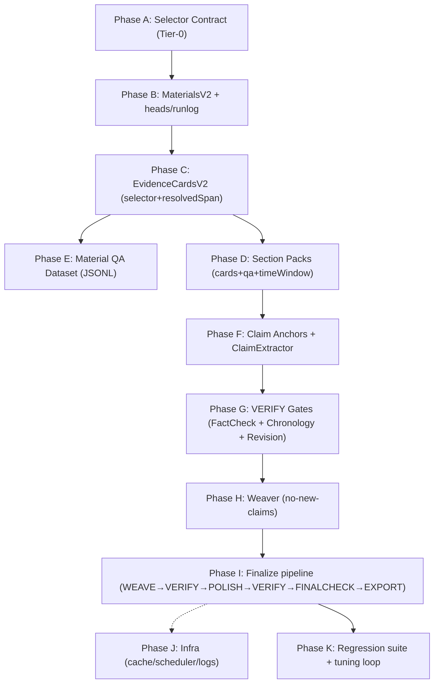

# Histwrite 出版级工作流加固 v4.1 Master Plan（Compute‑First / Token‑Unlimited）

> 这份文档是 **“单一入口（single entrypoint）”**：让任何新加入的工程师/Agent 不需要翻 5 个文件才能开始施工，也不需要猜依赖关系。
>
> v4.1 的核心口径与硬约束在“宪法”里；本文件负责：**索引 + 依赖 DAG + 施工顺序 + 回归门禁**。
>
> **适用范围说明（非常重要）**：本 v4.1 方案最初是在“上游插件态 Histwrite（extensions 语境）”的背景下形成的；但本公开仓库的主战场是 `runner/`（确定性命令层），天然模块化、测试完备。因此在本仓库推进 v4.1 时，**以 `runner/src/*` 为唯一真值落点**；上游“拆巨石/State 迁移”等内容仅作为参考，不作为本仓库的前置条件。

---

## 0) 你应该先读哪几个文件（按优先级）

1) **v4.1 宪法（系统边界/工件/门禁/Selector Contract）**  
   - `docs/plans/2026-03-10-histwrite-publication-workflow-v4.1-selector-contract.md`
2) **可执行工单级任务拆分（含全局依赖 DAG + 每个 Task 的输入/输出/验收）**  
   - `docs/plans/2026-03-10-histwrite-v4.1-selector-contract-task-breakdown.md`
3) **Public Repo Mapping（路径映射/复用清单/hot files）**  
   - `docs/plans/2026-03-11-histwrite-v4.1-public-repo-mapping.md`
4) **外部最佳实践对齐（Anthropic/GitHub/bub：为什么这么设计）**  
   - `docs/plans/2026-03-11-histwrite-v4.1-external-best-practices.md`

> 上游参考（仅当你要把能力反哺回插件态时再读）：
> - `docs/plans/2026-03-10-histwrite-monolith-decomposition.md`
> - `docs/plans/2026-03-10-histwrite-schema-migration-v1-to-v2.md`
> - `docs/plans/2026-03-10-histwrite-material-text-usage-inventory.md`

---

## 1) v4.1 的“不可违背”核心原则（摘要版）

1) **Compute‑First / Token‑Unlimited**：默认用更多计算换出版级可靠（多候选/仲裁/复核/门禁闭环），但用缓存/批处理/调度器避免并发墙。
2) **Claim → Evidence → Citation**：任何可核查事实必须可追溯；任何不确定必须显式标注（争议/推断/缺口）。
3) **三重门禁**：`FactCheck / Chronology / Finalcheck` 为阻断式 Gate（blockers>0 就不能 finalize/export）。
4) **Selector Tier‑0**：跨组件只认 `TextQuoteSelector(exact+prefix/suffix)`；跨语言边界不信任 offset；接收端必须 `verifyOrReanchor()`；失败必须进入【缺口/重入库】流程。
5) **长篇一致性**：BlueprintV2 负责全局记忆（人物卡/术语表/时间轴/约束配置）；Weaver 只缝合不造事实，weave 后必须再 VERIFY。

---

## 2) 全局依赖 DAG（施工顺序不是线性的）

> 完整 DAG 与每个 Task 的“硬依赖/软依赖”在：  
> `docs/plans/2026-03-10-histwrite-v4.1-selector-contract-task-breakdown.md`

这里给一个“你今天就能用”的高层 DAG（宏观版本）：



---

## 3) Repo Reality（本仓库落点与现实约束）

### 3.1 本仓库现状（截至 2026-03-11）

本仓库结构是“内容优先 + runner 为主命令层”：

- `content/`：模板、规范、rubrics、learn 记忆（公开、可复用）
- `runner/`：确定性命令（本仓库的核心可执行层）
- `relay/`：可选登录态浏览器接管
- `plugin-openclaw/`：薄插件入口（只做命令分发，不承载业务逻辑）

因此 v4.1 的 **Selector Contract / Artifacts / Gates / Weaver / QA Dataset** 等能力，默认落点建议为：

```
runner/src/
  selector/        # Tier‑0: normalize/mapping/resolve + vectors + torture/fuzz
  artifacts/       # Blueprint/Materials/EvidenceCards/QADataset/Draft/Reports
  gates/           # FactCheck/Chronology/Finalcheck（阻断式）
  weave/           # Narrative Weaver（no-new-claims）
  prompts/         # tool-as-contract prompts（可版本化）
```

### 3.2 “热文件 single-owner”策略（仍然必须执行）

如果你要并行启多个 agent，必须先约定 **hot files** 的单一所有权（single-owner），否则 merge conflict 会把项目拖死。

建议 hot files（推进 v4.1 时）：
- `runner/src/cli.ts`（命令面/参数/dispatch）
- `runner/src/project.ts`（项目布局/paths/状态落盘）
- `runner/src/indexing.ts`（材料入库与索引，是 Selector/QA/Gates 的上游）

---

## 4) 最短可交付里程碑（Milestones）

> 注意：这不是“省事版”，而是“最短可形成闭环并可回归”的里程碑。

### Milestone M0：Artifacts 地基 + Selector Gate 完成

- 完成 `Artifacts v2`：Blueprint/Materials（raw/norm/index）/EvidenceCards（selector+resolvedSpan）/QADataset（JSONL）
- 完成 `Macro Workflow`：至少能跑通 `EVIDENCE → DRAFT → VERIFY` 的最小闭环（允许缺口，但必须可追责）
- 验收：`pnpm test`（本仓库 vitest 全量回归必须通过）

### Milestone M1：Selector Tier‑0 + Evidence 升级可跑通

- Selector Contract（normalize/mapping/resolve/torture/fuzz/vectors）全部通过，且被设为阻断门禁
- EvidenceCards 升级为：`quote → selectorBundle → resolvedSpan`（并能从 rawText 重提取）

### Milestone M2：写作闭环（Draft→Verify→Fix→Finalize）可稳定复跑

- Writer 写入 claim anchors
- FactCheck/Chronology 能阻断 unsupported/高风险
- Weaver 能缝合但不新增 claim，并在 weave 后再次 VERIFY
- Finalize 产出：`Final.md + factcheck.json + chronology.json + finalcheck-report.md + run-log.jsonl`

---

## 5) 回归与验收（“可靠”必须可验收）

**所有 Phase 的默认验收门槛（publish/finalize）**：
- `FactCheckReport.blockers == 0`
- `ChronologyReport.blockers == 0`（或所有 high_risk 都已人工确认并落盘）
- `finalcheck.placeholderCount == 0 && localPathRisks == 0`
- 文中不存在未归因“学界认为/普遍认为”（必须绑定二手来源或改为谨慎表述/缺口）

**Selector Contract 的硬门禁**（任何功能都不能绕过）：
- normalize/mapping/resolve/向量契约/Unicode torture/fuzz 全部通过
- Contract 变更必须 bump `selectorContractVersion` + 更新向量文件 + 全套测试通过

---

## 6) 外部最佳实践对齐（你为什么会在这里看到它们）

v4.1 并不是“凭空想象的理想架构”，它显式对齐了：
- Anthropic：agents/tooling 的工程化经验（tool-as-contract、多 agent 编排、评测与迭代）
- GitHub Agentic Workflows：安全架构与工作流组织方式
- bub / tape.systems：强调可追溯日志/可回放 pipeline 的理念（但不直接引入 runtime）

这些对齐点的具体链接与解释在 v4.1 宪法中：
- `docs/plans/2026-03-10-histwrite-publication-workflow-v4.1-selector-contract.md`
